# 🇨🇳 Китай · Осень 2026 — маршрут для двоих

**Даты:** вылет из Москвы поздним вечером **22 октября**, в Китае **23 октября – 2 ноября**, прилёт в Москву **3 ноября**.
**Стиль:** природа Юго-Западного Китая + футуристичная архитектура (как в ваших сохранённых фото).
**Уровень:** комфорт (отели 4★ / хорошие апартаменты, удобные перелёты, 1-й класс поездов).
**Темп:** 3 базы, поглубже — без беготни.

**Логика маршрута (open-jaw):** прилёт в **Чунцин** → природа (**Улун** + **Чжанцзяцзе**) → вылет из **Шанхая**. Так вы не возвращаетесь в одну точку и экономите день и деньги.

```
Москва ──✈── Чунцин ──🚄── Улун (одним днём, возврат в Чунцин)
                │
                └──🚄── Чжанцзяцзе ──✈── Шанхай ──✈── Москва
```

| База | Ночей | Что ради чего |
|------|:----:|----------------|
| 🌃 Чунцин | 3 (23–25.10) | Футуризм + хаб к Улуну |
| 🏔 Чжанцзяцзе | 3 (26–28.10) | Горы Аватара + Тяньмэнь |
| 🏙 Шанхай | 4 (29.10–01.11) | Бунд, Пудун, сады + водный городок |

---

## ⚠️ Виза и важное перед поездкой

- **Виза НЕ нужна.** Безвизовый режим для граждан РФ (туризм, до 30 дней по обычному загранпаспорту) **продлён до 31 декабря 2027 года** — ваши даты попадают. Нужен только действующий загранпаспорт (желательно со сроком +6 мес.). Перед вылетом перепроверьте статус — режим политический.
- **Деньги:** наличные почти не нужны. Поставьте **Alipay** и **WeChat Pay** и привяжите карту (иностранные карты сейчас работают). Российские Visa/Mastercard/МИР в Китае **не принимаются** напрямую — Alipay/WeChat решают это.
- **Связь и интернет:** в Китае заблокированы Google, Instagram, WhatsApp, YouTube. Купите заранее **eSIM** (Trip.com / Airalo) или возьмите рабочий **VPN** ещё в России (в Китае их сложно скачать). Карты — оффлайн-карты + китайский **Amap/Baidu Maps**.
- **Погода в конце октября:** Чунцин/Ханчжоу/Шанхай ~14–22 °C, бывает пасмурно и влажно; **в горах Чжанцзяцзе холодно**, ночью у вершин близко к 0 °C (на ваших фото автор тоже мёрз). Берите тёплый слой, ветровку/дождевик и удобную обувь.
- **Билеты на поезда** иностранцы бронируют по загранпаспорту через Trip.com или в кассе/автомате (нужен паспорт). Бронируйте за 2–4 недели — на скоростные поезда места разбирают.

> 💡 Личные данные (паспорта, сканы) для бронирований храните аккуратно: при оформлении через сервисы это обработка ПДн — давайте только проверенным площадкам и не пересылайте сканы в открытых чатах (актуально и по 152-ФЗ).

---

## ✈️🚄 Билеты: что и где брать (с ценами и ссылками)

> Цены — ориентир для класса «комфорт» на двоих, осень 2026. Курсы для пересчёта: **¥1 ≈ 12 ₽**, **$1 ≈ 80 ₽** (проверьте на день покупки). **Фильтры под вашу просьбу:** не более **1 пересадки** и пересадка **не дольше 5 часов** — ставьте эти фильтры в поиске.

### 1. Перелёт Москва → Чунцин (CKG) — 22–23 октября
- **Прямой:** Tianjin Airlines (возобновили рейс Москва–Чунцин), ~9 ч.
- **С 1 пересадкой (часто дешевле):** Air China / China Eastern / China Southern / Hainan — стыковка в Пекине/Шанхае/Урумчи. **Берите стыковку 1.5–4 ч**, не больше.
- **Ориентир:** ~28 000–45 000 ₽/чел в одну сторону (эконом, комфортные стыковки).
- 🔎 Поиск: [Trip.com Москва→Чунцин](https://ru.trip.com/flights/moscow-to-chongqing/airfares-mow-ckg/) · [Aviasales CKG](https://www.aviasales.ru/cities/chuntsin-ckg)

### 2. Внутренний перелёт Чжанцзяцзе (DYG) → Шанхай (PVG/SHA) — 29 октября
- Прямой рейс **~2 ч 20 мин**, China Eastern / Spring Airlines / Juneyao Air. Берите прилёт в **Хунцяо (SHA)** — он ближе к центру, чем Пудун.
- **Ориентир:** от ~$95–150 (≈ 7 500–12 000 ₽/чел).
- 🔎 Поиск: [Trip.com Чжанцзяцзе→Шанхай](https://ru.trip.com/flights/zhangjiajie-to-shanghai/airfares-dyg-sha/)

### 3. Перелёт Шанхай (PVG/SHA) → Москва — 2 ноября
- **Прямой:** Аэрофлот (SU) из Пудуна, ~9 ч 50 мин; также China Eastern.
- **С 1 пересадкой:** дешевле, стыковка в Пекине/центральной Азии — снова фильтр ≤ 5 ч.
- **Ориентир:** ~24 000–40 000 ₽/чел.
- 🔎 Поиск: [Trip.com Шанхай→Москва](https://ru.trip.com/flights/shanghai-to-moscow/airfares-sha-mow/)

> 💡 **Совет по перелётам:** ищите единым **multi-city** билетом «Москва → Чунцин // Шанхай → Москва» (open-jaw) — часто выходит дешевле двух односторонних и логистически удобнее. Внутренний перелёт Чжанцзяцзе→Шанхай берите отдельно у китайских лоукостеров (Spring Airlines / Juneyao).

### Поезда (высокоскоростные, класс «G»)
| Маршрут | Дата | Время в пути | 2-й кл. | 1-й кл. (реком.) | Рекоменд. поезд |
|---------|------|:---:|:---:|:---:|---|
| Чунцин → Улун Юг | 25.10 | от 40 мин | ~¥75 | ~¥120 | утренний G |
| Улун → Чунцин | 25.10 (вечер) | от 40 мин | ~¥75 | ~¥120 | вечерний G |
| Чунцин Восток → Чжанцзяцзе Запад | 26.10 | 2–2.5 ч | ~¥197–273 | ~¥310–430 | **G2445** 09:52→12:20 |

- 🔎 Расписание и бронь: [Trip.com Trains](https://ru.trip.com/trains/) · [Travel China Guide](https://www.travelchinaguide.com/china-trains/) · [China Discovery](https://www.chinadiscovery.com/china-trains/)
- 💡 На скоростных поездах в Китае комфортен и 2-й класс — на коротком плече до Улуна переплата за 1-й класс необязательна; берите 1-й только на 2.5-часовой Чунцин→Чжанцзяцзе.

---

# 📅 Маршрут по дням

---

## День 0 — 22 октября (чт): вылет из Москвы
Поздний вечер — вылет. В самолёте, как писал автор ваших фото, «покормят вкусно 2 раза, лететь 8–10 часов, тяжело, но того стоит». Разница с Москвой **+5 часов**.

---

## 🌃 ЧУНЦИН (Chongqing) — 23–25 октября

Город-киберпанк: небоскрёбы лезут прямо на скалы над слиянием рек Янцзы и Цзялин, монорельс ныряет сквозь жилой дом, ночью всё в неоне. Идеальный «вау»-старт и удобный хаб — отсюда 40 мин до Улуна и 2 ч до Чжанцзяцзе.

**Где жить:** центр **Цзефанбэй (Jiefangbei)** или у **Хунъядун** — всё в пешей доступности, виды на реку. (В референсе — Qimen Theme Hotel на 39 этаже у Hongyadong, ~1383 ₽/ночь.)

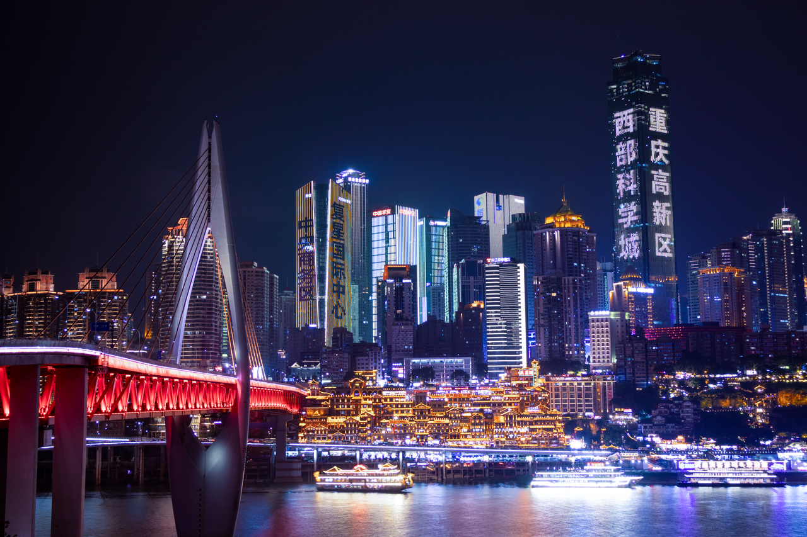
*Ночной Чунцин — небоскрёбы над слиянием рек.*

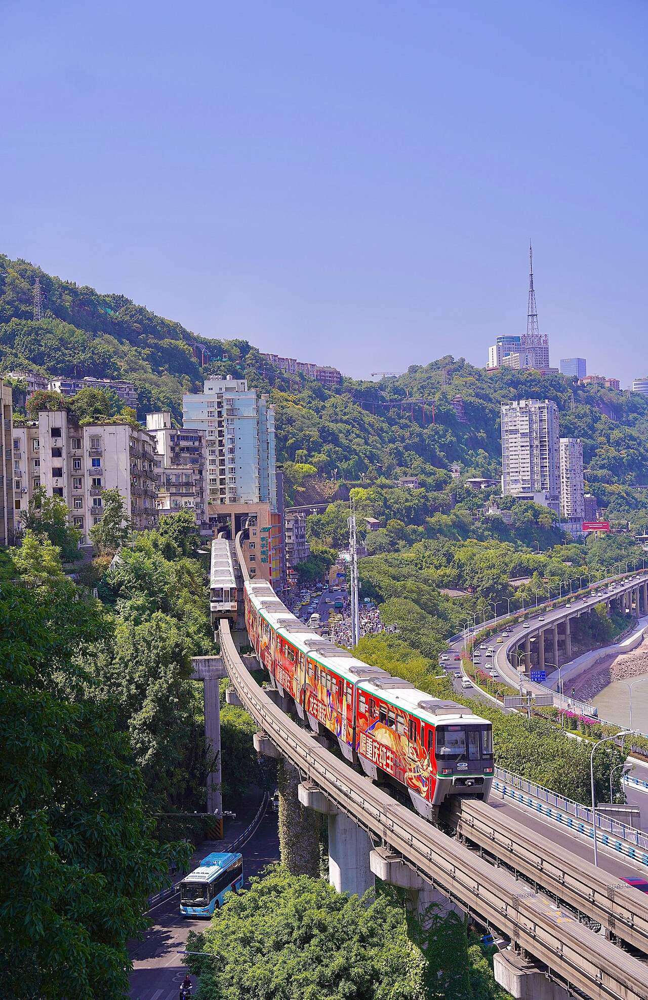
*Лицзыба (Liziba) — монорельс проходит сквозь жилой дом.*

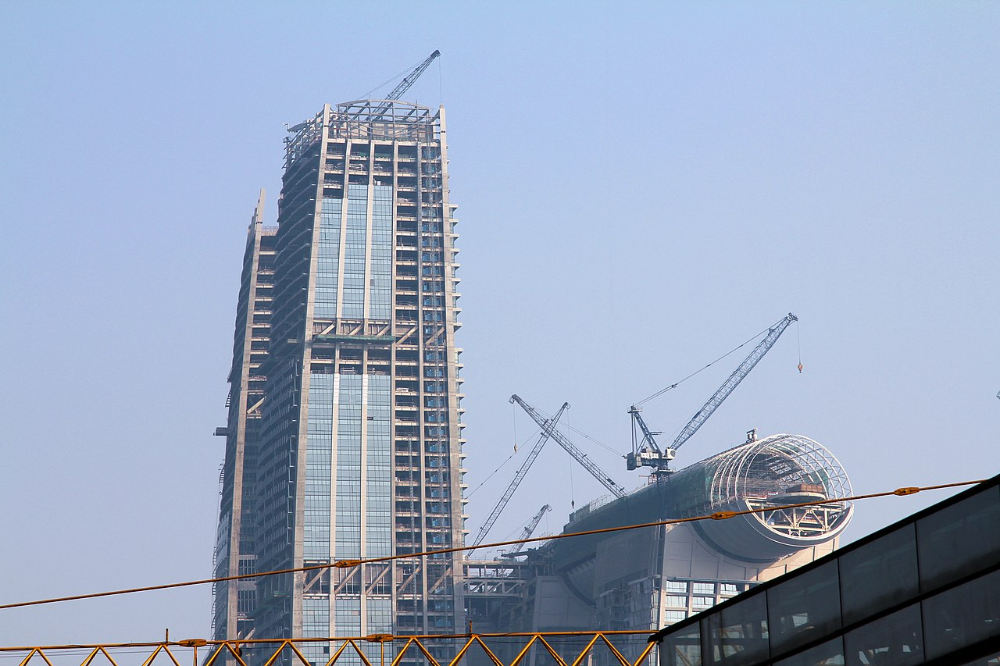
*Raffles City Chongqing на стрелке Цзянбэйцзуй — «горизонтальный небоскрёб».*

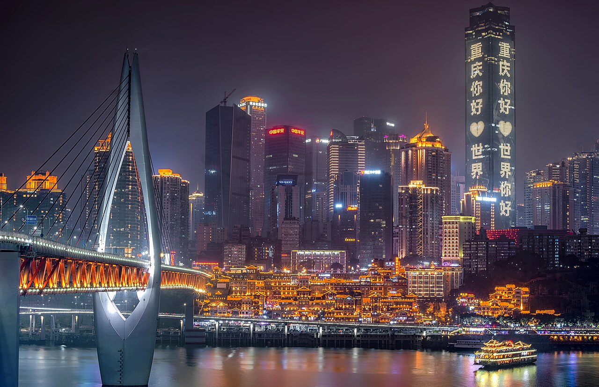
*Подсвеченные мосты через Янцзы — вечерняя классика Чунцина.*

### 23.10 (пт) — прилёт
- Прилёт днём/вечером, заселение в центре.
- Вечерняя прогулка: **Хунъядун (Hongyadong)** — многоярусный «висячий» комплекс в неоне (как из «Унесённых призраками»), вид с **моста Цяньсымэнь / Дуншуймэнь** на подсвеченный город.

### 24.10 (сб) — футуризм Чунцина
- **Лицзыба (Liziba)** — поймать кадр монорельса сквозь дом.
- **Raffles City** + смотровая **The Crystal** (Чжанбэйцзуй) — мост-небоскрёб и панорама стрелки.
- **Чунцинская художественная галерея** и неоновые набережные.
- **Шанчэн / «горные» лестницы-улочки (Shancheng Third Lane)** — старый вертикальный город (локация с ваших фото).
- Вечер: **парк Элин (Eling Park)** — лучший закатный вид на город.

### 25.10 (вс) — день в УЛУНЕ (одной поездкой)
Скоростной поезд от Чунцина до станции **Улун** — от 40 мин. Целый день в карстовом парке, вечером назад в Чунцин (ночуем там же).

---

## 🌉 УЛУН (Wulong Karst) — 25 октября, дневная вылазка

Объект ЮНЕСКО: гигантские природные каменные арки-«мосты», глубокий каньон, водопад и древний почтовый двор на дне ущелья (локации съёмок «Трансформеров» и «Цветка и сабли»). На ваших фото — стеклянный лифт в скале и лодка в изумрудном каньоне.

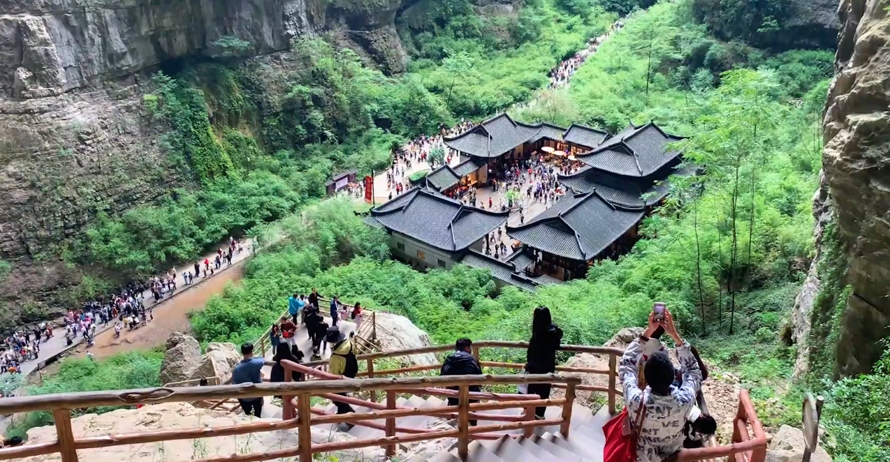
*«Три природных моста» — циклопические каменные арки каньона.*

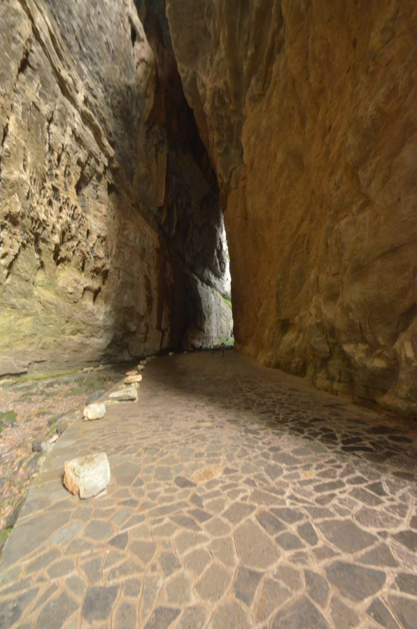
*Дно каньона с историческим почтовым двором Тяньфу.*

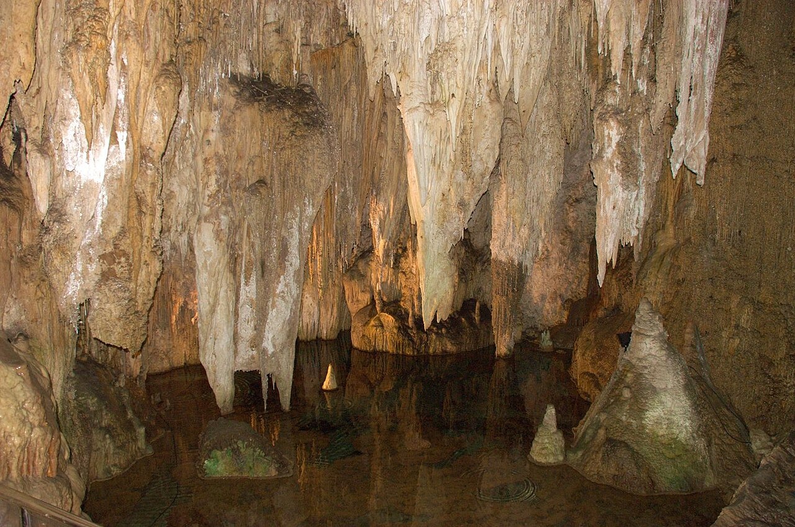
*Пещера Фужун (Furong) — сталактитовые залы рядом с Улуном (доп. опция).*

**План дня:**
- Утренний поезд Чунцин → Улун.
- **Три природных моста (Three Natural Bridges)** — на спуск стеклянный лифт, прогулка по дну ущелья ~2–3 ч.
- По желанию рядом — **долина Луншуйся** (Longshuixia Gorge) или **пещера Фужун**.
- Вечерний поезд назад в Чунцин. 💡 Выделяйте на парк весь день — он большой.

---

## 🏔 ЧЖАНЦЗЯЦЗЕ (Zhangjiajie) — 26–28 октября

«Те самые горы Аватара» — тысячи песчаниковых столбов в тумане, плюс гора **Тяньмэнь** с «Небесными вратами» и стеклянной тропой по обрыву. Главная природная цель поездки.

**Тактика (по совету с ваших фото):** ночуйте **внутри парка** (район Юаньцзяцзе) и поднимайтесь к смотровым **к 7 утра** — почти без очередей и с лучшим светом/туманом. Вход в нацпарк ~¥225 (≈ 2 700 ₽), действует несколько дней.

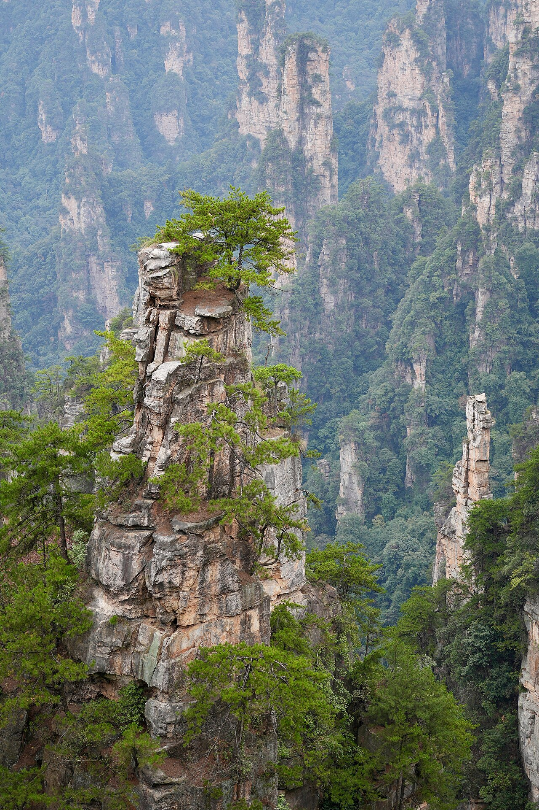
*Песчаниковый лес-«столбы» Улинъюань — визитная карточка парка.*

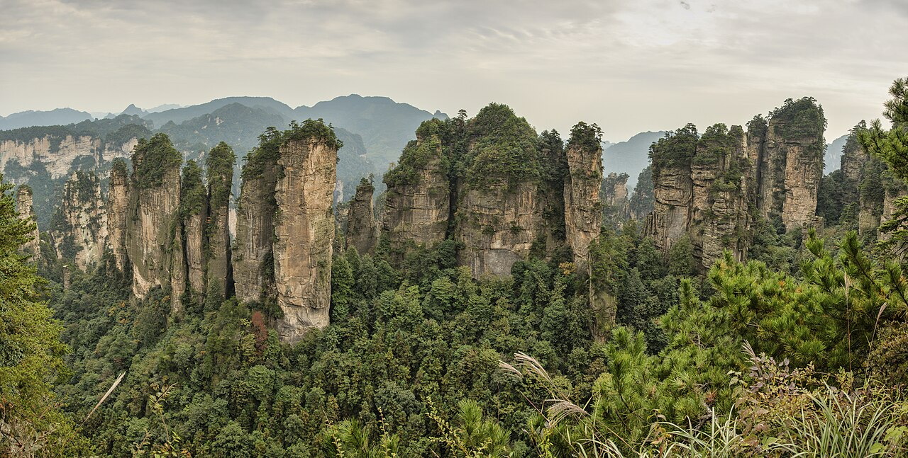
*Панорама с плато Хуаншичжай — море пиков.*

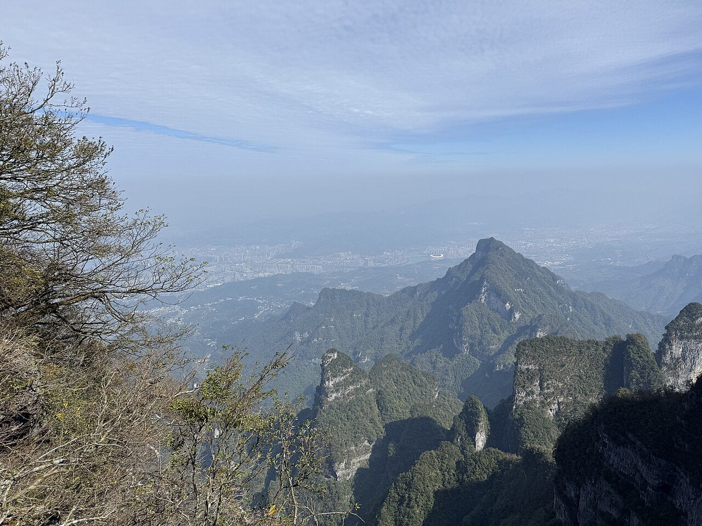
*Гора Тяньмэнь и вид на город с обрыва.*

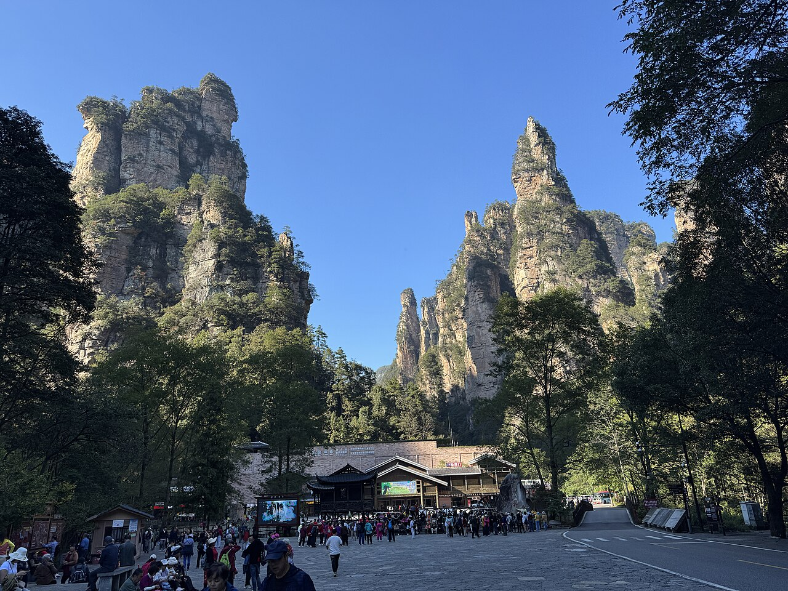
*Стеклянный лифт Байлун (Bailong) — 326 м вдоль отвесной скалы.*

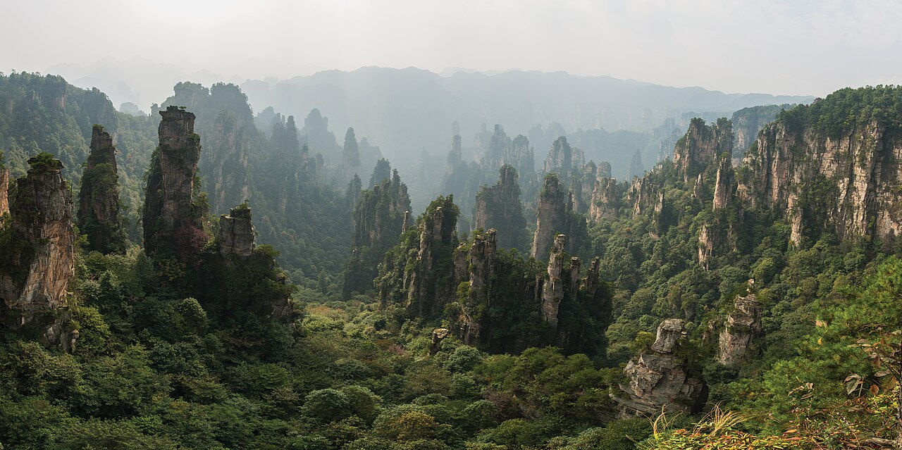
*Гора Тяньцзы — смотровые над лесом каменных пиков.*

### 26.10 (пн) — переезд + Тяньмэнь
- Утренний поезд **Чунцин Восток → Чжанцзяцзе Запад** (G2445, 09:52→12:20).
- После обеда — **гора Тяньмэнь (Tianmen)**: самая длинная канатка мира, серпантин «98 поворотов», **стеклянная тропа** по краю обрыва и пещера-арка **«Небесные врата»**.
- Ночь в городе Чжанцзяцзе.

### 27.10 (вт) — нацпарк, день 1 (горы Аватара)
- Вход в **Zhangjiajie National Forest Park**, подъём на **лифте Байлун**.
- **Юаньцзяцзе (Yuanjiajie)** — «гора Аллилуйя» / парящая гора из «Аватара», мост «Первый под небом».
- Заселение в **хоумстей внутри парка** (как Wangkelai в референсе — 100 м от вида; ночью прохладно — берите тёплое).

### 28.10 (ср) — нацпарк, день 2 + спуск
- Ранний подъём (~7:00) на **гору Тяньцзы (Tianzi)** и смотровые **Yangjiajie** — лучшие панорамы.
- Прогулка вдоль **ручья Золотого кнута (Golden Whip Stream)** внизу — макаки, скалы, река.
- По желанию: **Большой каньон Чжанцзяцзе + стеклянный мост** (самый длинный стеклянный мост, отдельный билет).
- Вечер — спуск, ночь в городе Чжанцзяцзе ближе к аэропорту (DYG).

---

## 🏙 ШАНХАЙ (Shanghai) — 29 октября – 1 ноября

Финальный аккорд и теперь полноценная база на **4 ночи**: набережная **Бунд** с колониальной архитектурой напротив сверкающего **Пудуна**, классический **сад Юй**, небоскрёбы Луцзяцзуй, Французский квартал и водный городок под боком. Отсюда удобный прямой вылет в Москву. Четыре дня дают время и на «вау»-Шанхай, и на спокойный темп без беготни.

**Где жить:** район **Бунд / Нанкинская улица** или **Синьтяньди** — центрально и атмосферно.

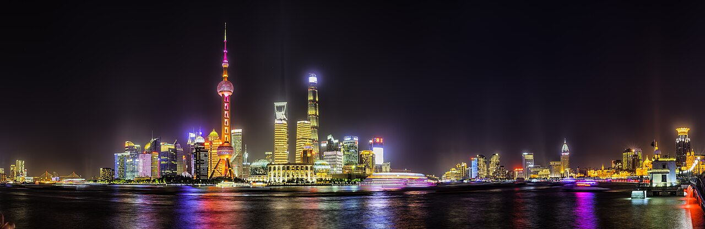
*Бунд (The Bund) ночью — историческая набережная.*

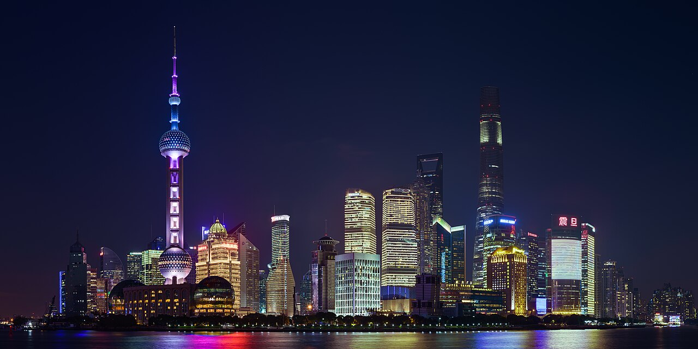
*Пудун (Луцзяцзуй): «открывашка», «шприц» и Shanghai Tower.*

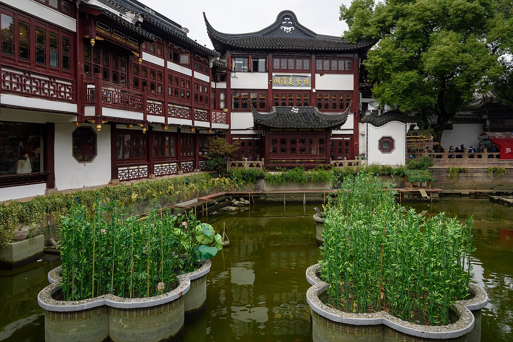
*Классический сад Юй (Yu Garden) — старый Шанхай.*

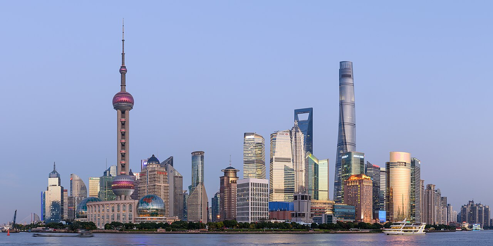
*Панорама Луцзяцзуй с Shanghai Tower — 2-е по высоте здание мира.*

### 29.10 (чт) — перелёт + первый Бунд
- Утренний перелёт **Чжанцзяцзе (DYG) → Шанхай (SHA/PVG)**, ~2 ч 20 мин; заселение в центре.
- После гор — спокойный вход в город: **сад Юй** и Старый город (чайный дом Хусиньтин, базар).
- Вечер: **Бунд (The Bund)** — подсветка набережной и панорама Пудуна, прогулка по Нанкинской.

### 30.10 (пт) — Пудун и высота
- **Луцзяцзуй**: смотровая на **Shanghai Tower** (или «открывашка» SWFC) — лучше в ясный день.
- Музей/набережная Пудуна, при желании — Шанхайский океанариум.
- Вечер: круиз по реке **Хуанпу** — Бунд и Пудун с воды.

### 31.10 (сб) — старый Шанхай и квартал
- **Французский квартал / Синьтяньди / Тяньцзыфан** — платаны, ар-деко, кафе, шопинг.
- **Бывшая резиденция** и тихие улочки Сюйхуэй; по желанию — храм Нефритового Будды.
- Вечер свободный: рынок, бар с видом на Бунд.

### 01.11 (вс) — водный городок (день-вылазка)
- Поездка в водный городок **Чжуцзяцзяо (Zhujiajiao)** — каналы, мосты, лодки (~1 ч от центра) — мягкая «вода и старина» взамен Ханчжоу.
- _Альтернатива:_ день в **Сучжоу** (скоростной поезд ~30 мин) — классические сады и каналы, если хочется большего.
- Возврат в Шанхай, прощальный ужин с видом на Бунд.

---

## ✈️ День возвращения — 2–3 ноября
- **2 ноября (пн):** днём — буфер/последние покупки, вечером — вылет **Шанхай → Москва** (прямой Аэрофлот ~9 ч 50 мин, выигрыш −5 ч по времени).
- **3 ноября (вт):** вы в Москве. ✅

---

## 💰 Оценка бюджета на двоих (комфорт, без еды/развлечений)

| Статья | Ориентир на двоих |
|--------|------------------|
| Перелёт Москва↔Китай (open-jaw, 2 чел.) | ~110 000–170 000 ₽ |
| Внутр. перелёт Чжанцзяцзе→Шанхай (2) | ~16 000–24 000 ₽ |
| Поезда (Улун, Чжанцзяцзе) (2) | ~10 000–15 000 ₽ |
| Отели 4★/апартаменты, 10 ночей | ~40 000–70 000 ₽ |
| Входные билеты (Улун, Чжанцзяцзе, Тяньмэнь, канатки) | ~20 000–30 000 ₽ |
| **Итого (без еды и транспорта внутри городов)** | **~200 000–310 000 ₽** |

💡 **Как сэкономить:**
1. Берите перелёт **open-jaw одним билетом** и ловите акции авиакомпаний за 1.5–3 мес.
2. На коротких поездах — **2-й класс** (комфортный), 1-й только Чунцин→Чжанцзяцзе.
3. Внутренний перелёт DYG→HGH — у китайских лоукостеров за 2–4 недели.
4. **Apartments/хоумстеи** (как в референсе) дешевле отелей и часто удобнее расположены.
5. Билеты в парки — комплексные/многодневные, через Trip.com или WeChat без очередей.

---

## 🔀 Гибкость и альтернативы

- **Хотите больше природы вместо города?** Один из 4 дней Шанхая можно отдать под **Сучжоу** (сады ЮНЕСКО, ~30 мин на поезде) или **Чжуцзяцзяо** (водный городок) — оба уже в плане как вылазки.
- **Хотите ещё «вау»-воды?** Полноценный день-круиз по реке Хуанпу или поездка к каналам — Шанхай как база это легко позволяет.
- **Хотите добавить «вау» воды?** Вместо Улуна — **круиз по Янцзы / Три ущелья** из Чунцина (но это уже 1–2 ночи, ломает темп).
- **Гонконг (как в референсе автора)** добавлять не советую при таком тайминге — это отдельный погранконтроль и крюк; на 11 дней он съест 2 дня логистики.
- **Если переживаете за стыковки** — берите прямой Tianjin Airlines в Чунцин и прямой Аэрофлот из Шанхая, итог дороже на ~15–25%, но без пересадок.

---

### 📎 Полезные ссылки
- Авиабилеты: [Trip.com Москва→Чунцин](https://ru.trip.com/flights/moscow-to-chongqing/airfares-mow-ckg/) · [Trip.com Шанхай→Москва](https://ru.trip.com/flights/shanghai-to-moscow/airfares-sha-mow/) · [Trip.com Чжанцзяцзе→Шанхай](https://ru.trip.com/flights/zhangjiajie-to-shanghai/airfares-dyg-sha/) · [Aviasales](https://www.aviasales.ru/)
- Поезда: [Trip.com Trains](https://ru.trip.com/trains/) · [Travel China Guide](https://www.travelchinaguide.com/china-trains/) · [China Discovery](https://www.chinadiscovery.com/china-trains/)
- Виза/въезд: [Trip.com — без визы в Китай](https://ru.trip.com/guide/info/виза-в-китай.html)

> _Фотографии — со свободной лицензией Wikimedia Commons (папка `images/`), служат для визуализации локаций._

---

## 📋 Мои бронирования (заполняется по мере поиска)

> Вставляйте ссылку прямо в колонку **Ссылка** в формате `[открыть](вставьте_url)` — тогда она станет кликабельной. Колонка **Статус**: 🔍 ищу · ⭐ кандидат · ✅ забронировано. Цены — за двоих, итоговые.

### ✈️🚄 Транспорт

| # | Направление | Дата | Перевозчик/рейс              | Цена (2 чел.) | Статус | Ссылка |
|:-:|------------|:----:|------------------------------|:-------------:|:------:|--------|
| 1 | ✈️ Москва → Чунцин (CKG) | 23.10 | Tianjin Airlines GS7942      |  | 🔍 | `[открыть](url)` |
| 2 | 🚄 Чунцин → Улун (туда-обратно) | 25.10 |                              |  | 🔍 | `[открыть](url)` |
| 3 | 🚄 Чунцин Восток → Чжанцзяцзе Запад | 26.10 |                              |  | 🔍 | `[открыть](url)` |
| 4 | ✈️ Чжанцзяцзе (DYG) → Шанхай (SHA/PVG) | 29.10 | Shanghai Airlines FM9344     |  | 🔍 | `[открыть](url)` |
| 5 | ✈️ Шанхай (PVG/SHA) → Москва | 02.11 | China Eastern Airlines MU247 |  | 🔍 | `[открыть](url)` |
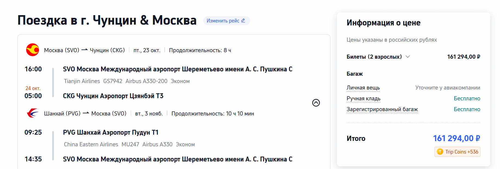

### 🏨 Отели / жильё

| # | Город | Заезд → выезд | Ночей | Отель/апартаменты | Цена за всё | Статус | Ссылка |
|:-:|-------|:-------------:|:-----:|-------------------|:-----------:|:------:|--------|
| 1 | 🌃 Чунцин (Цзефанбэй/Хунъядун) | 23.10 → 26.10 | 3 |  |  | 🔍 | `[открыть](url)` |
| 2 | 🏔 Чжанцзяцзе (город) | 26.10 → 27.10 | 1 |  |  | 🔍 | `[открыть](url)` |
| 3 | 🏔 Чжанцзяцзе (внутри парка) | 27.10 → 28.10 | 1 |  |  | 🔍 | `[открыть](url)` |
| 4 | 🏔 Чжанцзяцзе (у аэропорта DYG) | 28.10 → 29.10 | 1 |  |  | 🔍 | `[открыть](url)` |
| 5 | 🏙 Шанхай (Бунд/Синьтяньди) | 29.10 → 02.11 | 4 |  |  | 🔍 | `[открыть](url)` |

> 💡 Когда вставите все ссылки — скиньте мне файл обратно, сверю даты/стыковки и помогу выбрать лучший вариант по цене и пересадкам. Сканы паспортов для бронирований — только на проверенных площадках (это обработка ПДн, 152-ФЗ).
