# 🇨🇳 Китай · Осень 2026 — Чжанцзяцзе · Яншо · Гуанчжоу

**Даты:** вылет из Москвы вечером **23 октября** (18:50), в Китае **24 октября – 3 ноября**, дома **вечером 3 ноября** (21:15).
**Стиль:** сразу к главному — горы «Аватара», вылазка в древний городок на водопаде, карстовые пейзажи реки Ли, а финал — кантонский юг: Гуанчжоу с башней и Жемчужной рекой плюс однодневный бросок в Шэньчжэнь за небоскрёбами и 🛍 электроникой.
**Темп:** три базы вместо четырёх — чемоданы разбираем трижды за поездку. Движемся с северо-запада на юго-восток, к концу — всё спокойнее.

**Логистика:** перелёт через **Пекин** (Beijing · 北京; длинная стыковка ~10.5 ч — при желании успеваем в город) → прилёт в **Чанде** (Changde · 常德, CGD) вечером 24.10 → такси в аэропорт → станция **Чанде** (Changde Railway Station · 常德站) → поезд ~50 мин до **Чжанцзяцзе-Запад** (Zhangjiajie West · 张家界西站), ночью заселение. Пять ночей на одной базе в Чжанцзяцзе, включая ночь внутри парка и **дневную вылазку в Фужунчжэнь** (Furongzhen · 芙蓉镇) налегке. Дальше на юг: **Яншо** (Yangshuo · 阳朔) → **Гуанчжоу** (Guangzhou · 广州, прямой поезд) → однодневка в **Шэньчжэнь** (Shenzhen · 深圳) → метро в аэропорт **Байюнь** → рейс домой. Пекин — только транзит.

```
Москва ──✈ ~7.5ч── Пекин ──✈ ~2.5ч── Чанде ──🚕 ~40мин + 🚄 ~50мин── Чжанцзяцзе ──🚄 ~7ч── Яншо ──🚄 ~2-3ч── Гуанчжоу ──🚇 ~50мин── аэропорт Байюнь ──✈── Москва
                                                    ↕ 🚄 25 мин                                        ↕ 🚄 40 мин
                                                 Фужунчжэнь (день)                                Шэньчжэнь (день)

Moscow ── Beijing ── Changde ── Zhangjiajie (⇄ Furongzhen) ── Yangshuo ── Guangzhou (⇄ Shenzhen) ── Moscow
莫斯科 ── 北京 ── 常德 ── 张家界 (⇄ 芙蓉镇) ── 阳朔 ── 广州 (⇄ 深圳) ── 莫斯科
```

| База | Ночей | Зачем |
|------|:----:|-------|
| 🏔 **Чжанцзяцзе**<br>Zhangjiajie · 张家界 | 5 (24–29.10) | Гора Тяньмэнь, горы «Аватара», ночь внутри парка, Стеклянный мост + вечер в Фужунчжэне |
| 🏞 **Яншо**<br>Yangshuo · 阳朔 | 3 (29.10–01.11) | Река Ли, карст, бамбуковые плоты |
| 🌆 **Гуанчжоу**<br>Guangzhou · 广州 | 2 (01–03.11) | Кантонская башня, Жемчужная река, Шамянь + однодневка в Шэньчжэнь с 🛍 шоппингом |

> 🎒 **Главный принцип этой версии:** база в Чжанцзяцзе бронируется **сплошняком 24–29.10**, включая ночь 26.10, когда вы ночуете в парке. «Пустая» ночь стоит ~¥300, зато чемоданы всё это время стоят в одном номере: и в парк, и в Фужунчжэнь вы едете с рюкзаком. То же в Гуанчжоу — в Шэньчжэнь едете налегке.

---

## ⚠️ Перед поездкой — коротко

- **Виза не нужна** (безвиз для РФ продлён до 31.12.2027, до 30 дней). Загранпаспорт со сроком +6 мес.
- **Оплата:** поставьте **Alipay** и **WeChat Pay**, привяжите карту — наличные почти не нужны. Российские карты напрямую не работают.
- **Интернет:** Google/Instagram/WhatsApp/YouTube заблокированы. Заранее купите **eSIM** или возьмите рабочий **VPN** ещё в России. Карты — **Amap**.
- **Погода:** **в горах Чжанцзяцзе холодно** — у вершин ночью близко к 0 °C, тёплый слой + дождевик обязательны. Дальше теплеет: Яншо ~15–24 °C, Гуанчжоу в начале ноября ~20–28 °C — лучший сезон в году.
- **Поезда и билеты в парки** берите за 2–4 недели через Trip.com (по загранпаспорту). Дешёвые короткие плечи (Фужунчжэнь, Гуанчжоу⇄Шэньчжэнь) можно брать за 1–2 дня.

> 💡 Сканы паспортов для бронирований давайте только проверенным площадкам — это обработка ПДн (152-ФЗ).

---

## ✈️🚄 Транспорт между базами

| Плечо | Дата | Как | Время | Ориентир (2 чел.) |
|-------|:----:|-----|:-----:|:-----------------:|
| ✈️ **Москва → Пекин**<br>Moscow → Beijing · 莫斯科 → 北京 | 23–24.10 | SVO **18:50** → Пекин ~07:20 (+1) | 7 ч 30 м | в составе билета* |
| 🔄 **стыковка в Пекине**<br>Beijing · 北京 (PEK 首都 / PKX 大兴) | 24.10 | ~07:20 → ~17:50; **багаж получить и сдать заново** | 10 ч 30 м | — |
| ✈️ **Пекин → Чанде**<br>Beijing → Changde · 北京 → 常德 (CGD) | 24.10 | ~17:50 → **20:20**, аэропорт Таохуаюань (Taohuayuan · 常德桃花源机场) | 2 ч 30 м | в составе билета* |
| 🚕 **аэропорт Чанде → вокзал Чанде**<br>Changde Airport → Changde Railway Station · 常德桃花源机场 → 常德站 | 24.10 | такси ~20 км, ~¥120–140 | 30–45 мин | ~0.3 т₽ |
| 🚄 **Чанде → Чжанцзяцзе-Запад**<br>Changde → Zhangjiajie West · 常德 → 张家界西 | 24.10 (ночь) | поезд «G»/«D», ~39 рейсов в день, **последний ~22:21 → 23:12** | ~50 мин | ~1.5–2 т₽ |
| 🚕 **Чжанцзяцзе-Запад → отель**<br>Zhangjiajie West · 张家界西站 | 24.10 (ночь) | такси ~9 км | ~20 мин | ~0.3 т₽ |
| 🚄 **Чжанцзяцзе-Запад ⇄ Фужунчжэнь**<br>Zhangjiajie West ⇄ Furongzhen · 张家界西 ⇄ 芙蓉镇 | 28.10 | **вылазка налегке**: ~20 поездов в день в каждую сторону, ¥40 за 2-й класс; **последний обратный ~21:30 → 21:55** | ~25 мин | ~2 т₽ туда-обратно |
| 🚄 **Чжанцзяцзе → Яншо**<br>Zhangjiajie → Yangshuo · 张家界 → 阳朔 | 29.10 | ⚠️ прямых нет; два способа — см. врезку ниже (прямой D3967 до Гуйлиня, либо через Чанша-Южный) | **~7–7.5 ч** + 40 мин трансфер | ~8–10 т₽ |
| 🚄 **Яншо → Гуанчжоу-Южный**<br>Yangshuo → Guangzhou South · 阳朔 → 广州南 | 01.11 | **прямой**, ~24 рейса в день по линии Гуйян–Гуанчжоу (贵广高铁); быстрейшие 1 ч 54 м | ~2–3 ч | ~3–4 т₽ |
| 🚇 **Гуанчжоу-Южный → отель (Чжуцзян Нью-Таун)**<br>Guangzhou South → Zhujiang New Town · 广州南 → 珠江新城 | 01.11 | метро линия 2 → 1 → 3 (или такси ~¥90) | 45–50 мин | ~0.1 т₽ |
| 🚄 **Гуанчжоу-Южный ⇄ Шэньчжэнь**<br>Guangzhou South ⇄ Shenzhen · 广州南 ⇄ 深圳 | 02.11 | **однодневка налегке**: поезда «G»/«C» каждые 10–20 мин, ¥75 за 2-й класс | 35–40 мин | ~3.5 т₽ туда-обратно |
| 🚇 **отель → аэропорт Байюнь**<br>Zhujiang New Town → Baiyun Airport · 珠江新城 → 广州白云国际机场 | 03.11 | **метро линия 3 без пересадки на другую линию**, до ст. 机场南 (Airport South) | 50–55 мин | ~0.05 т₽ |
| ✈️ **Гуанчжоу → Москва**<br>Guangzhou → Moscow · 广州 → 莫斯科 (CAN) | 03.11 | **CZ8003** (China Southern, A350): CAN 13:35 → SVO 21:15, техостановка в **Ухане** (Wuhan · 武汉) 1 ч 35 м | 12 ч 40 м | в составе билета* |

> *Единый билет «Москва → (Пекин) → Чанде // Гуанчжоу → Москва», China Southern. В Пекине **багаж выдают и сдают заново** — заложите время и уточните, из какого аэропорта вылет: **PEK (Шоуду) и PKX (Дасин) — разные аэропорты**, переезд между ними ~1.5–2 ч. При стыковке 10.5 ч успеваете в любом случае, но маршрут надо знать заранее.
> ⚠️ **Узкое место — вечер 24.10.** Прилёт в Чанде 20:20; до последнего поезда на Чжанцзяцзе (~22:21) остаётся ~2 часа с учётом багажа и такси. Ложится, но без запаса: **если рейс из Пекина задержан больше чем на ~1 час — ночуем в Чанде** (отели у вокзала) и едем первым поездом 07:57 → 08:48.
> 🚗 **План Б (надёжнее):** заранее заказать трансфер «аэропорт Чанде → отель в Чжанцзяцзе» — ~200 км по скоростной, ~2.5–3 ч, ~¥600–900 на машину. Приезд ~23:30 без риска опоздать на поезд.
> ✅ **Что упростилось против прошлой версии:** пропали ночёвка в Фужунчжэне с двумя такси до станции и утренний марш-бросок «Футянь → Гуанчжоу-Южный → аэроэкспресс» в день вылета. Теперь в день вылета — одно метро от двери отеля.
> 🔎 [Trip.com Авиа](https://ru.trip.com/flights/) · [Trip.com Поезда](https://ru.trip.com/trains/) · [Aviasales](https://www.aviasales.ru/)

### 🚨 Чжанцзяцзе → Яншо: как ехать 29.10

**Прямого поезда Чжанцзяцзе → Яншо не существует, и это не сбой поисковика.** Отдельной линии из западной Хунани на Гуйлинь пока нет (строится), поэтому на юг приходится делать крюк — либо на восток через Чаншу, либо медленным поездом через Хэнъян. Закладывайте **весь день**, а не полдня.

| Вариант | Маршрут | Ходовое время | Пересадок | Комментарий |
|---|---|:---:|:---:|---|
| **A. Прямой D3967** (меньше всего пересадок) | **Чжанцзяцзе-Запад 07:12 → Гуйлинь-Северный 14:13** (桂林北), далее любой поезд линии 贵广 до **Яншо** (~30 мин) | ~7 ч | **1** | ¥342 за 2-й класс. Одна посадка вместо двух, но ранний выезд и медленный поезд (250 км/ч). В Яншо-городке ~16:00 |
| **B. Через Чаншу** (гибче) | Чжанцзяцзе-Запад → **Чанша-Южный** (长沙南, 51 рейс в день, 1 ч 43 м – 3.5 ч) → **Гуйлинь-Северный** (桂林北, 21 рейс, от 2 ч 38 м) → **Яншо** | ~7–7.5 ч | **2** | Можно выехать не в 07:12, а в 08:30–09:00 и всё равно быть в Яншо к 17:30–18:00. Страховка, если на D3967 нет мест |
| **C. Без Яншо** | Чжанцзяцзе-Запад → **Гуанчжоу-Южный** прямым «G» | ~5.5 ч | 0 | На случай, если Яншо когда-нибудь решите выбросить |

> ⚠️ **Станция Яншо — не в Яншо.** Она стоит у **Синпина** (Xingping · 兴坪), ~30–40 км от городка: плюс ~40 мин на такси/шаттле поверх любого варианта выше.
> 💡 **Как искать самому:** на 12306/Trip.com включите режим «пересадка» (中转/Transfer) и вводите станции иероглифами: **张家界西 → 阳朔**. Поиск по «городу Гуйлинь» не поможет.
> 🎫 **Порядок бронирования:** сначала пробуйте D3967 (мест мало, он один в день), запасной вариант B добираете за неделю до даты.

### 🚄 Фужунчжэнь одним днём: как это работает

Городок в 25 минутах езды от Чжанцзяцзе-Запада, билет — ¥40, поездов ~20 в день в каждую сторону. **Главное в Фужунчжэне — вечерняя подсветка водопада**, а её вылазка сохраняет полностью: последний обратный поезд уходит из Фужунчжэня **~21:30 и в 21:55 вы уже на Чжанцзяцзе-Западном**. Теряете только утро в городке без толп — за это получаете целый свободный день в Чжанцзяцзе, куда наконец помещается Стеклянный мост.

> ⚠️ **Обязательно перепроверьте последний поезд на 12306 за 2–3 недели до даты** — вся схема держится на нём. Если вечерний рейс уберут из расписания, запасной ход: такси Фужунчжэнь → Чжанцзяцзе (~100 км, ~1.5 ч, ~¥400–500).
> 🚕 От станции **Фужунчжэнь** (芙蓉镇站) до самого городка ~10 км — такси/автобус 15–20 мин. Заложите этот кусок в оба конца.

---

## 🈶 Названия: русский · English · 中文

> Иероглифы — главный рабочий инструмент: их показывают таксисту, вбивают в 12306/Trip.com и в Amap. Латиница на китайских вокзалах есть не везде.

### 🏙 Города и районы

| Русский | English | 中文 | Примечание |
|---------|---------|------|------------|
| Москва | Moscow | 莫斯科 | |
| Пекин | Beijing | 北京 | транзит |
| Ухань | Wuhan | 武汉 | техостановка на обратном пути |
| Чанде | Changde | 常德 | прилёт 24.10 |
| Чжанцзяцзе | Zhangjiajie | 张家界 | база 1 |
| Улинъюань (нацпарк) | Wulingyuan | 武陵源 | район нацпарка, ночь 26.10 |
| Фужунчжэнь / Фужун | Furong Town (Furongzhen) | 芙蓉镇 | вылазка 28.10; ист. название — **王村** (Ванцунь) |
| Чанша | Changsha | 长沙 | ж/д узел (вариант B) |
| Гуйлинь | Guilin | 桂林 | пересадка |
| Яншо | Yangshuo | 阳朔 | база 2 |
| Синпин | Xingping | 兴坪 | городок на реке Ли; там же станция «Яншо» |
| Гуанчжоу | Guangzhou | 广州 | база 3 |
| Чжуцзян Нью-Таун | Zhujiang New Town | 珠江新城 | где живём в Гуанчжоу |
| Тяньхэ (район) | Tianhe | 天河 | деловой центр, моллы |
| Ливань (район) | Liwan | 荔湾 | Шамянь, старый город |
| Шэньчжэнь | Shenzhen | 深圳 | однодневка 02.11 |
| Футянь (район) | Futian | 福田 | CBD, Ping An, Хуацянбэй |

### 🚄 Железнодорожные станции

| Русский | English | 中文 | Где в маршруте |
|---------|---------|------|----------------|
| Чанде | Changde Railway Station | 常德站 | 24.10, посадка ночью |
| Чжанцзяцзе-Западный | Zhangjiajie West | 张家界西站 | 24.10 приезд · 28.10 вылазка · 29.10 отъезд |
| Чжанцзяцзе (старый вокзал) | Zhangjiajie | 张家界站 | ⚠️ **не путать** — обычные поезда, другой конец города |
| Фужунчжэнь | Furongzhen | 芙蓉镇站 | 28.10; ~10 км до городка |
| Чанша-Южный | Changsha South | 长沙南站 | пересадка (вариант B) |
| Гуйлинь-Северный | Guilin North | 桂林北站 | пересадка на Яншо |
| Яншо | Yangshuo | 阳朔站 | ⚠️ фактически в **兴坪** (Синпин), ~30–40 км от городка |
| Гуанчжоу-Южный | Guangzhou South | 广州南站 | 01.11 приезд · 02.11 в Шэньчжэнь |
| Гуанчжоу-Восточный | Guangzhou East | 广州东站 | альтернатива для поездки в Шэньчжэнь |
| Шэньчжэнь-Северный | Shenzhen North | 深圳北站 | 02.11, **отсюда возвращаться вечером** |
| Футянь | Futian | 福田站 | 02.11, приезд утром |
| Аэропорт-Юг (метро) | Airport South | 机场南站 | 03.11, линия 3 до терминалов |

### ✈️ Аэропорты

| Русский | English | 中文 | Код |
|---------|---------|------|-----|
| Шереметьево | Sheremetyevo | 谢列梅捷沃机场 | SVO |
| Пекин Шоуду (Столичный) | Beijing Capital | 北京首都国际机场 | PEK |
| Пекин Дасин | Beijing Daxing | 北京大兴国际机场 | PKX |
| Чанде Таохуаюань | Changde Taohuayuan | 常德桃花源机场 | CGD |
| Гуанчжоу Байюнь | Guangzhou Baiyun | 广州白云国际机场 | CAN |

---

# 🗓 Маршрут одним взглядом

| День | Дата | Город | Что смотрим | Кратко о дне |
|:---:|:----:|-------|-------------|--------------|
| 0 | 23.10 пт | Москва ✈️<br>Moscow · 莫斯科 | — | 18:50 вылет в Пекин (7 ч 30 м, +5 ч к Москве) |
| 1 | 24.10 сб | Пекин ✈ Чанде 🚄 🏔 Чжанцзяцзе<br>北京 ✈ 常德 🚄 张家界 | транзит (можно Пекин) | стыковка 10.5 ч — успеваем в город; 20:20 Чанде, ночной поезд, ~23:45 в отеле |
| 2 | 25.10 вс | 🏔 Чжанцзяцзе<br>Zhangjiajie · 张家界 | гора Тяньмэнь | самая длинная канатка мира, стеклянные тропы, «Небесные врата» (старт не раньше 10:00 — отсыпаемся) |
| 3 | 26.10 пн | 🏔 Чжанцзяцзе<br>Zhangjiajie · 张家界 | Юаньцзяцзе · лифт Байлун | горы «Аватара» и мост «Первый под небом»; **ночь внутри парка с рюкзаком** |
| 4 | 27.10 вт | 🏔 Чжанцзяцзе<br>Zhangjiajie · 张家界 | Тяньцзы · Золотой кнут | рассвет над «лесом пиков», прогулка по дну ущелья, к вечеру назад в городской отель |
| 5 | 28.10 ср | 🏔 Чжанцзяцзе ⇄ 🏮 Фужунчжэнь<br>张家界 ⇄ 芙蓉镇 | Стеклянный мост · вечер в Фужунчжэне | утром мост над Большим каньоном, днём поезд 25 мин, вечером подсвеченный водопад; в 21:55 обратно |
| 6 | 29.10 чт | 🚄 → 🏞 Яншо<br>张家界 → 阳朔 | переезд на весь день | ~7 ч + трансфер: D3967 напрямую до Гуйлиня или через Чаншу. Вечер на Западной улице |
| 7 | 30.10 пт | 🏞 Яншо<br>Yangshuo · 阳朔 | река Юйлун · Луна-гора | бамбуковый плот в утренней дымке, велосипед, арка-«полумесяц» |
| 8 | 31.10 сб | 🏞 Яншо<br>Yangshuo · 阳朔 | Синпин · холм Сянгун · шоу Impression | кораблик по «виду с ¥20», закат над излучиной Ли, вечером шоу на воде |
| 9 | 01.11 вс | 🚄 → 🌆 Гуанчжоу<br>阳朔 → 广州 | переезд · Шамянь · Кантонская башня | прямой поезд ~2–3 ч, в отеле к обеду; вечером башня на закате и круиз по Жемчужной реке |
| 10 | 02.11 пн | 🌆 Гуанчжоу ⇄ 🌇 Шэньчжэнь<br>广州 ⇄ 深圳 | 🛍 небоскрёбы и электроника | 40 мин на поезде: смотровая Ping An, Хуацянбэй, залив; вечером обратно в Гуанчжоу |
| 11 | 03.11 вт | Гуанчжоу → ✈️ Москва<br>广州 → 莫斯科 | — | ~09:30 метро линия 3 до Байюня; 13:35 CZ8003 (через Ухань), 21:15 — дома ✅ |

---

# 📅 Маршрут по дням

## День 0 — 23.10 (пт): вылет из Москвы
**18:50 — вылет из Шереметьево в Пекин**, в полёте 7 ч 30 м. Разница с Москвой **+5 часов** — в Пекине 24.10 около 07:20 по местному. Ночь проводим в самолёте: постарайтесь поспать, день 24-го будет длинным.

---

## 🏔 ЧЖАНЦЗЯЦЗЕ · Zhangjiajie · 张家界 — 24–29 октября

«Те самые горы Аватара»: тысячи песчаниковых столбов в тумане, плюс гора Тяньмэнь с «Небесными вратами». Начинаем с главного — пока ноги свежие, а впечатления не «замылены».
**Тактика:** одна база на пять ночей — отель в городе у нижней станции канатки Тяньмэнь, **бронируем сплошняком 24–29.10**. Ночь 26-го проводим **внутри парка** (Юаньцзяцзе), чтобы к 7 утра быть у смотровых без очередей и с туманом, — туда идём с рюкзаком, чемоданы остаются в номере. Так же налегке 28-го едем в Фужунчжэнь. Вход в нацпарк **Улинъюань** (Wulingyuan · 武陵源) ~¥225, действует несколько дней.

### 24.10 (сб) — день дороги: Пекин → Чанде → Чжанцзяцзе · 北京 → 常德 → 张家界

Длинный транзитный день, но к ночи мы на месте — и все дни в горах остаются целыми.

**~07:20 — Пекин.** Паспортный контроль (безвиз, штамп на въезд), **получаем багаж и сдаём его заново** на внутренний рейс. До вылета ~10.5 часов.

> 🏛 **Что делать со стыковкой.** Багаж можно оставить в камере хранения и съездить в город: от аэропорта до центра ~40–60 мин в одну сторону, реально остаётся ~5–6 часов. Компактный вариант без нервов — **Храм Неба** + пешеходный **Цяньмэнь/Дашилань** и обед. На площадь Тяньаньмэнь и в Гугун нужна **предварительная регистрация/билет онлайн** — если хочется именно туда, оформляйте заранее. Вернуться в аэропорт стоит за 2.5–3 ч до вылета.

**~17:50 — вылет в Чанде, 20:20 — прилёт (CGD, терминал T2).** Аэропорт Таохуаюань (Changde Taohuayuan · 常德桃花源机场) маленький, багаж выдают быстро.

**Вечерний бросок в горы** (по часам):
- **~20:45** — с багажом на выходе, берём такси до **вокзала Чанде** (Changde Railway Station · **常德站**; ~20 км, ~¥120–140);
- **~21:20–21:30** — на вокзале; досмотр и посадка;
- **~22:21 — последний поезд** до **Чжанцзяцзе-Западного** (Zhangjiajie West · **张家界西站**), в пути **~50 мин**;
- **~23:12** — Чжанцзяцзе-Западный, такси до отеля ~20 мин;
- **~23:45** — заселение.

> ⚠️ **Обязательно:** предупредите отель о **позднем заезде после 23:30** и оплатите бронь заранее — иначе ночью могут не заселить. Билет на поезд возьмите онлайн заранее, но с пониманием: при задержке рейса из Пекина он «сгорает».
> 🚗 **Если не хочется гонки** — трансфер прямо из аэропорта Чанде в отель Чжанцзяцзе (~200 км, 2.5–3 ч, ~¥600–900): выезд ~20:45, приезд ~23:30. Те же деньги на двоих, но без риска.
> 🛏 **План Б при задержке рейса:** ночуем в Чанде у вокзала и едем первым поездом **07:57 → 08:48** — тогда 25.10 начинается в Чжанцзяцзе к 09:30, Тяньмэнь всё равно успеваем.

### 25.10 (вс) — гора Тяньмэнь

**Гора Тяньмэнь (Tianmen)**
Самая длинная пассажирская канатка мира (~7.5 км) стартует прямо из центра города и ведёт на вершину; вдоль обрыва — **стеклянные тропы**, а серпантин «98 поворотов» уходит к пещере-арке **«Небесные врата»** (131 м в скале), к которой поднимаются 999 ступеней. Захватывает дух даже у бывалых.

После ночного приезда **высыпаемся** и стартуем к ~10:00 — на гору этого хватает: нижняя станция канатки в центре города, а сам маршрут (канатка → стеклянные тропы → эскалаторы к «Небесным вратам» → спуск шаттлом по «98 поворотам») занимает 5–6 часов. Билет берите **онлайн накануне** с таймслотом на утро — это главный способ не потерять время в очереди.
<div class="gallery">
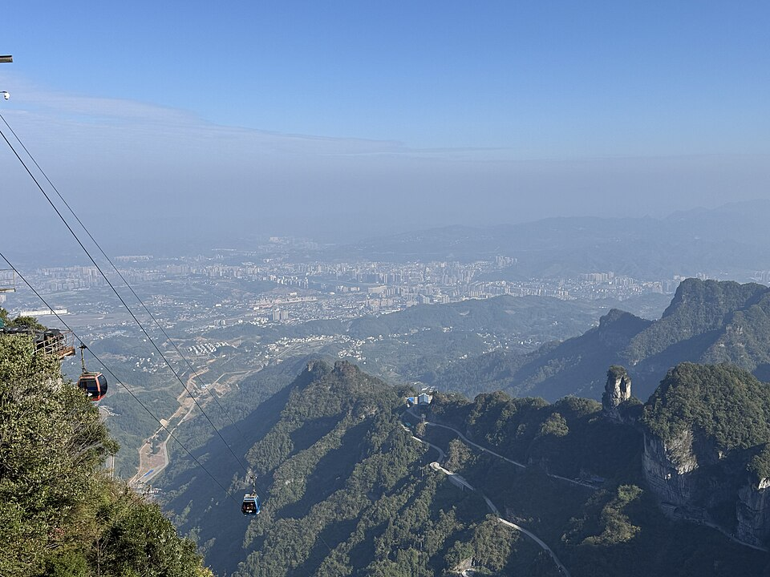
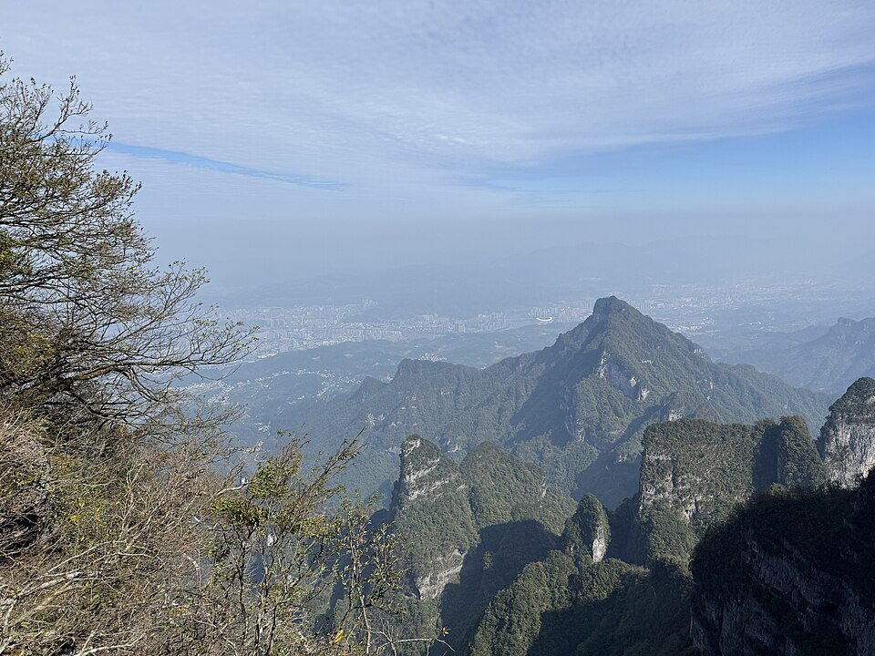

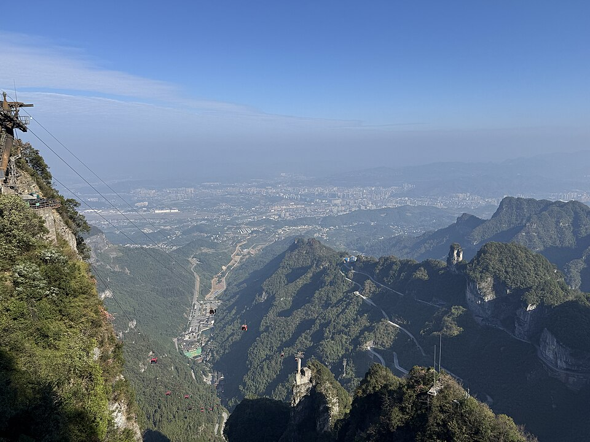
</div>

### 26.10 (пн) — нацпарк, горы «Аватара», ночь в парке

**Юаньцзяцзе (Yuanjiajie)** + лифт Байлун
С утра — **рюкзак на два дня, чемоданы остаются в городском отеле** — и переезд ко входу в нацпарк Улинъюань. Плато с легендарной «парящей горой Аллилуйя» — прообразом летающих гор «Аватара» — и мостом «Первый под небом». Наверх поднимает **стеклянный лифт Байлун** — 326 м вдоль отвесной скалы (самый высокий открытый лифт мира). Море каменных пиков в облаках.
<div class="gallery">


</div>
Ночь в **хоумстее внутри парка** — утром будете у смотровых первыми.

### 27.10 (вт) — Тяньцзы + Золотой кнут, вечером назад в город

**Гора Тяньцзы (Tianzi) + ручей Золотого кнута**
Ранний подъём на **Тяньцзы** — лучшие панорамы «леса пиков» (смотровые Хэлун, «Письмо с небес»); в 7 утра вы там практически одни. Дальше спуск к **ручью Золотого кнута (Golden Whip Stream)** — лёгкая прогулка по дну ущелья вдоль реки, скал и любопытных макак, ~6 км почти без набора высоты. К вечеру выходим через ворота Улинъюань и возвращаемся в городской отель (~40 мин на такси) — в свой же номер, где ждут чемоданы.

<div class="gallery">

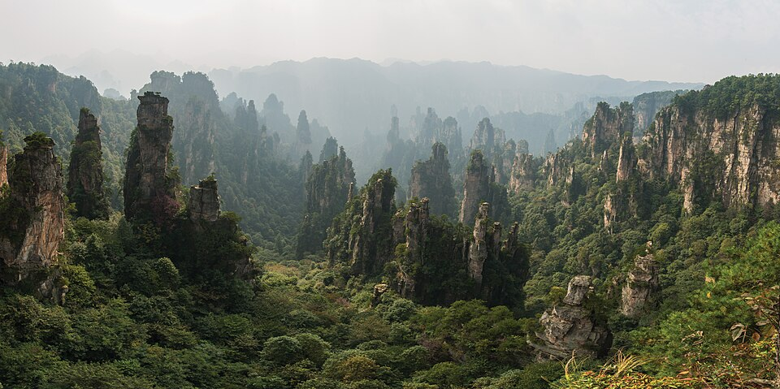
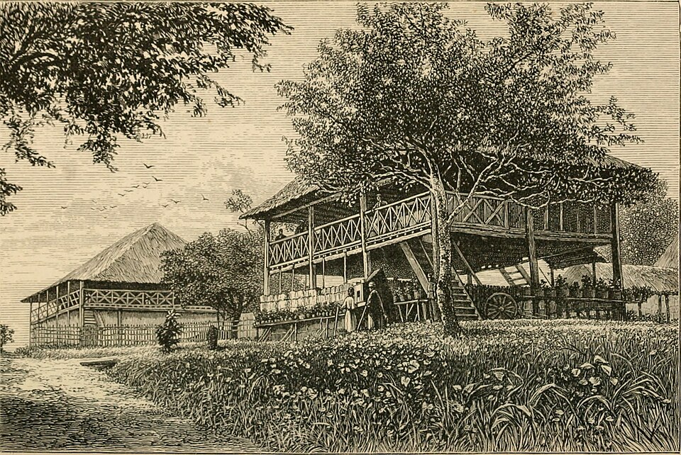
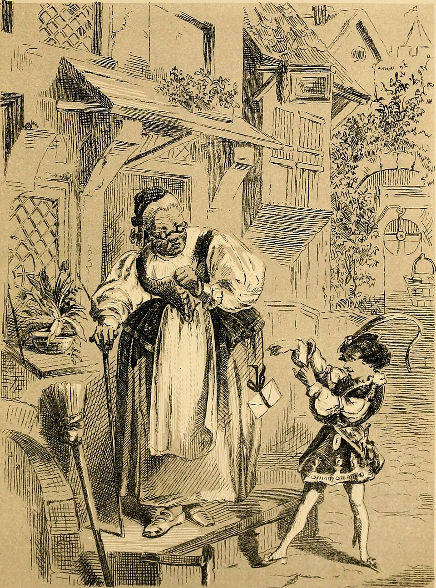
</div>

### 28.10 (ср) — Стеклянный мост утром, Фужунчжэнь вечером

Тот самый день, который освободился от переездов. Он делится надвое.

**Утро: Большой каньон Чжанцзяцзе + Стеклянный мост**
Самый длинный и высокий стеклянный мост в мире — 430 м длиной, 300 м над дном каньона, — по которому вы идёте буквально по воздуху. В прошлой версии маршрута он не помещался вообще; теперь ему есть место.
- **~07:30** — выезд из отеля (каньон в Улинъюане, ~50 мин);
- **~08:30** — таймслот на мост (**берите онлайн заранее**, вход по нему строгий);
- мост + верхняя тропа по краю каньона — ~2–2.5 ч; полный спуск на дно с лодкой добавит ещё ~1.5 ч (тогда Фужунчжэнь начнётся позже);
- **~12:00** — назад в город, обед.

<div class="gallery">

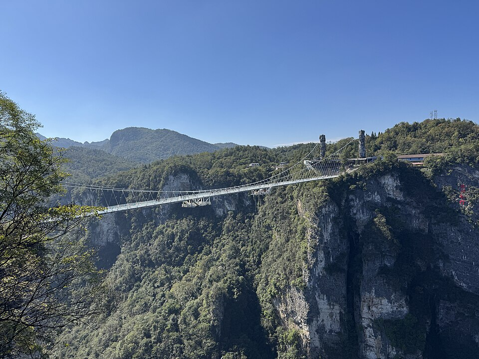
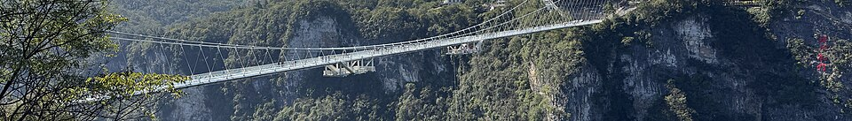
</div>

**День и вечер: вылазка в Фужунчжэнь** · Furong Town · 芙蓉镇
Древний городок народности **туцзя** (~2000 лет), «висящий на водопаде»: дома на сваях стоят прямо над 60-метровым каскадом Ванцунь (Wangcun Waterfall · 王村瀑布 — старое имя самого городка тоже **Ванцунь / 王村**, оно встречается на указателях и в такси). Прославился по фильму «Городок Хибискус» (1986). Главное зрелище — **вечером**, когда водопад и весь ярусный городок подсвечены.

- **~13:40** — на вокзал **Чжанцзяцзе-Западный**; **~14:30** — поезд, ~25 мин, ¥40 с человека;
- **~15:20** — такси со станции в городок (~10 км, 15–20 мин);
- день: мощёная главная улица, тропа **прямо за стеной водопада**, пристань и виды на реку Юшуй (Youshui · 酉水河); на ужин — фирменный рисовый тофу **мидоуфу**;
- **~18:30–20:45** — ради чего всё затевалось: подсветка. «Золотой» ярусный городок над чёрной водой;
- **~21:00** — такси на станцию, **~21:30 поезд**, **21:55** — Чжанцзяцзе-Западный, к 22:20 в отеле.

> ⚠️ **Точное время последнего поезда сверьте на 12306** за 2–3 недели и держите наготове номер местного такси: 100 км до Чжанцзяцзе на машине — ~¥400–500, неприятно, но не катастрофа.
> 💡 **Если утро в горах не нужно** — проведите его спокойно в городе (парк Улиншань, канатка на Тяньмэнь-байпас, массаж) и уезжайте в Фужунчжэнь на пару часов раньше: тогда городок достанется вам ещё и при дневном свете.

<div class="gallery">
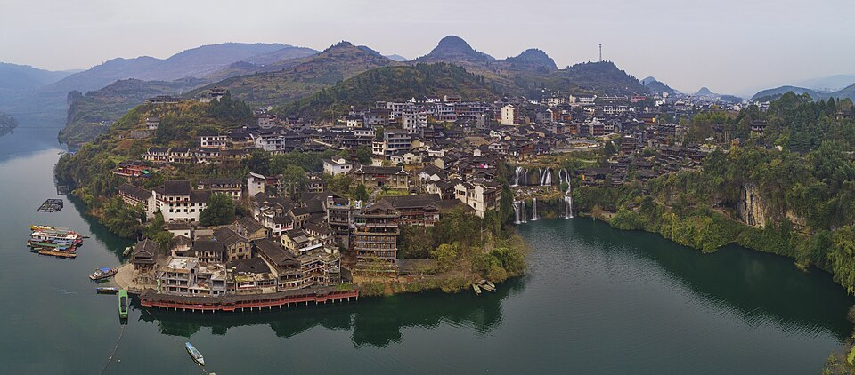

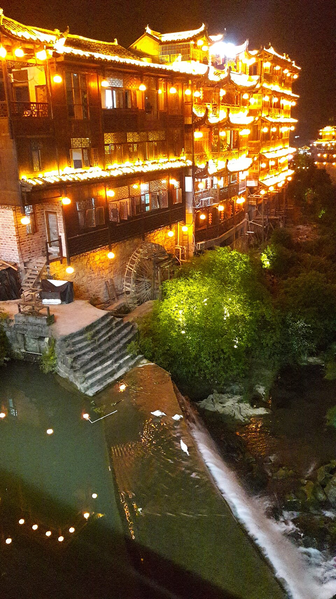
</div>

---

## 🏞 ЯНШО · Yangshuo · 阳朔 — 29 октября – 1 ноября

Открыточный карст: тысячи зелёных холмов-«пальцев» над изумрудной рекой Ли — пейзаж с купюры в 20 юаней. После гор — смена ритма: велосипед, бамбуковые плоты, ленивые вечера.
**Где жить:** в **Яншо** (Yangshuo · 阳朔) у Западной улицы, 3 ночи.

### 29.10 (чт) — день переезда

Поезд **Чжанцзяцзе → Яншо** — **прямых нет**, ~7 ч плюс ~40 мин трансфер со станции в городок (подробности — во врезке «Чжанцзяцзе → Яншо» выше).

- **Вариант A (D3967, 07:12):** одна пересадка в Гуйлине-Северном, в отеле ~16:00 — вечер на Западной улице целый.
- **Вариант B (через Чаншу, ~08:30):** две пересадки, в отеле ~18:00–19:00 — на ужин и короткую прогулку хватит.

**Западная улица (West Street / Сицзе)**
Главная пешеходная артерия Яншо — 1500 лет истории, сотни лавок, мастерских и кафе. Идеальный вечер дня переезда: поужинать, надышаться атмосферой, приглядеть чай (гуанси-чёрный, пуэр), шёлк, батик и веера — купить успеете в любой из вечеров.
<div class="gallery">
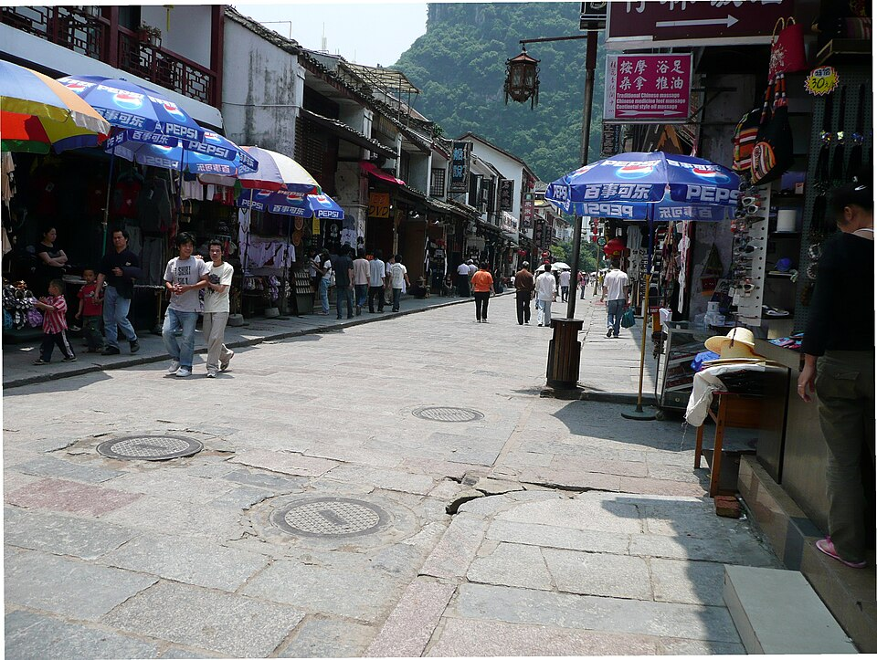


</div>

### 30.10 (пт) — река Юйлун + Луна-гора

**Бамбуковый плот по реке Юйлун (Yulong)**
Тихий приток без круизных теплоходов: неспешный сплав на бамбуковом плоту мимо рисовых полей, древних каменных мостов и холмов. Лучше всего утром, в дымке. Рядом отлично идёт прокат велосипеда по окрестным деревням.

**Луна-гора (Moon Hill)**
Холм со сквозной аркой-«полумесяцем»: по мере обхода арка «превращается» из полной луны в серп. Подъём ~800 ступеней к арке, сверху — панорама долины. Рядом — район скалолазания.

<div class="gallery">


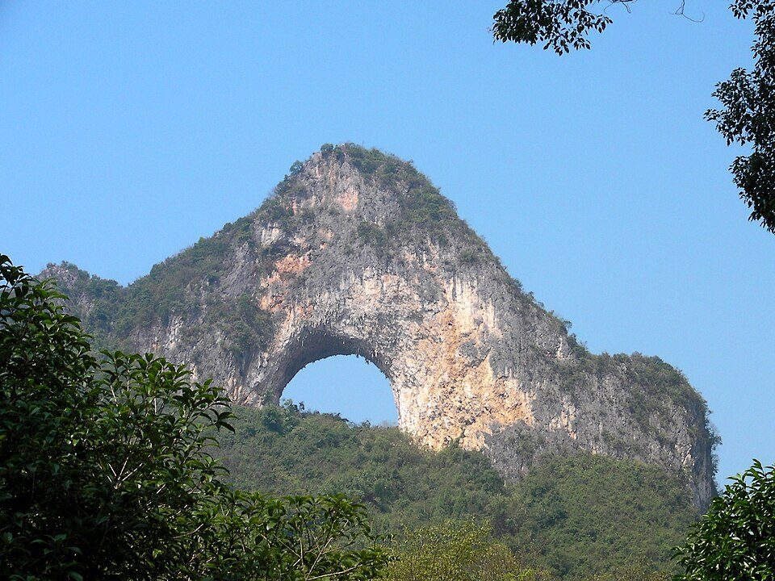

</div>

### 31.10 (сб) — Синпин, Сянгун + вечернее шоу

**Синпин · Xingping · 兴坪 и «вид с ¥20»**
Вместо полного круиза из **Гуйлиня** (Guilin · 桂林; теплоходы идут только по течению) — из Яншо в древний городок **Синпин** (~40 мин), оттуда кораблик или плот по самому красивому участку реки Ли **Яндти → Синпин** (Yangdi → Xingping · 杨堤 → 兴坪): рыбаки на плотах, буйволы у воды и тот самый пейзаж с 20-юаневой банкноты. Дешевле и короче большого круиза, а виды — те же.

**Холм Сянгун (Xianggong Hill)**
Лучшая обзорная точка на излучину реки Ли — короткий, но крутой подъём ~20 минут, сверху «те самые» фото Гуйлиня. По дороге из Синпина; красивее всего в косом вечернем свете или на рассвете.

**Шоу «Impression Sanjie Liu» (вечер)**
Грандиозное ночное представление режиссёра **Чжана Имоу** прямо на воде реки Ли: сцена — 2 км реки и 12 подсвеченных холмов, в шоу заняты сотни местных рыбаков. Свет, музыка и природный «задник» — must-see вечера в Яншо.

<div class="gallery">


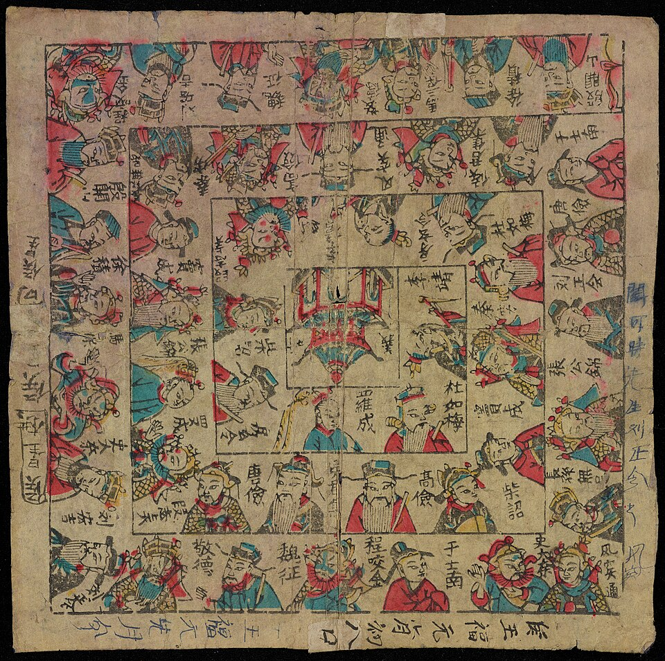
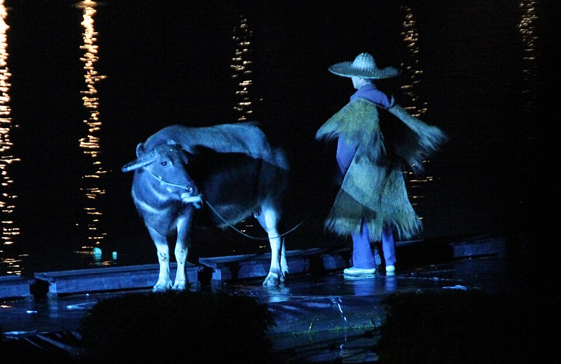

</div>

> 💡 Рисовые террасы **Лунцзи** (Longji · 龙脊梯田; полный день от Гуйлиня) в маршрут не помещаются. Если они принципиальны — можно пожертвовать рекой Юйлун 30.10.

---

## 🌆 ГУАНЧЖОУ · Guangzhou · 广州 — 1–3 ноября

Столица Кантона и «южные ворота» Китая: 2200 лет истории, главный порт Шёлкового пути, родина кантонской кухни — и при этом небоскрёбы Чжуцзян Нью-Тауна и 600-метровая башня над рекой. В начале ноября ~20–28 °C, самый приятный месяц в году.
**Где жить:** **Чжуцзян Нью-Таун** (Zhujiang New Town · 珠江新城) или район вокруг **Кантонской башни**. Причина простая: отсюда **метро линии 3 идёт прямо в аэропорт Байюнь** — в день вылета вниз на эскалаторе и через 50 минут вы у терминала, без вокзалов и пересадок между городами.

### 01.11 (вс) — переезд + вечер над Жемчужной рекой

- **~07:45** — выезд из отеля в Яншо на станцию (~40 мин);
- **~09:00** — прямой поезд **Яншо → Гуанчжоу-Южный** (阳朔 → 广州南), ~2–3 ч, ¥120–169 за 2-й класс;
- **~12:00** — Гуанчжоу-Южный, метро/такси в отель (~45 мин), заселение и обед.

**Шамянь** (Shamian Island · 沙面岛) — днём
Крошечный остров-концессия XIX века: платановые аллеи, англо-французские особняки пастельных тонов, ни одной высотки. Абсолютная тишина в десяти минутах от центра — идеально, чтобы прийти в себя после поезда. Рядом — **храм предков семьи Чэнь** (Chen Clan Ancestral Hall · 陈家祠, 1894): резьба по дереву и камню, керамические фризы на коньках крыш, лучший образец кантонского декора.

**Кантонская башня** (Canton Tower · 广州塔) — на закате
600 метров, «тонкая талия» из стальной сетки; смотровые площадки на 488 м, а на самой крыше — горизонтальное колесо обозрения «Bubble Tram» с прозрачными капсулами. Приходите за час до заката: город при свете, в сумерках и в неоне за один подъём.

**Хуачэн-сквер + круиз по Жемчужной реке** — вечером
Напротив башни через реку — ось **Хуачэн-сквер** (Flower City Square · 花城广场) с башнями CTF Finance Centre (530 м) и Guangzhou IFC (438 м) и оперным театром Захи Хадид. Завершить вечер лучше всего **круизом по Жемчужной реке** (珠江夜游, ~1–1.5 ч, причалы Дашатоу 大沙头 / Тяньцзы 天字码头): подсвеченные мосты, башня и весь новый CBD с воды.

<div class="gallery">
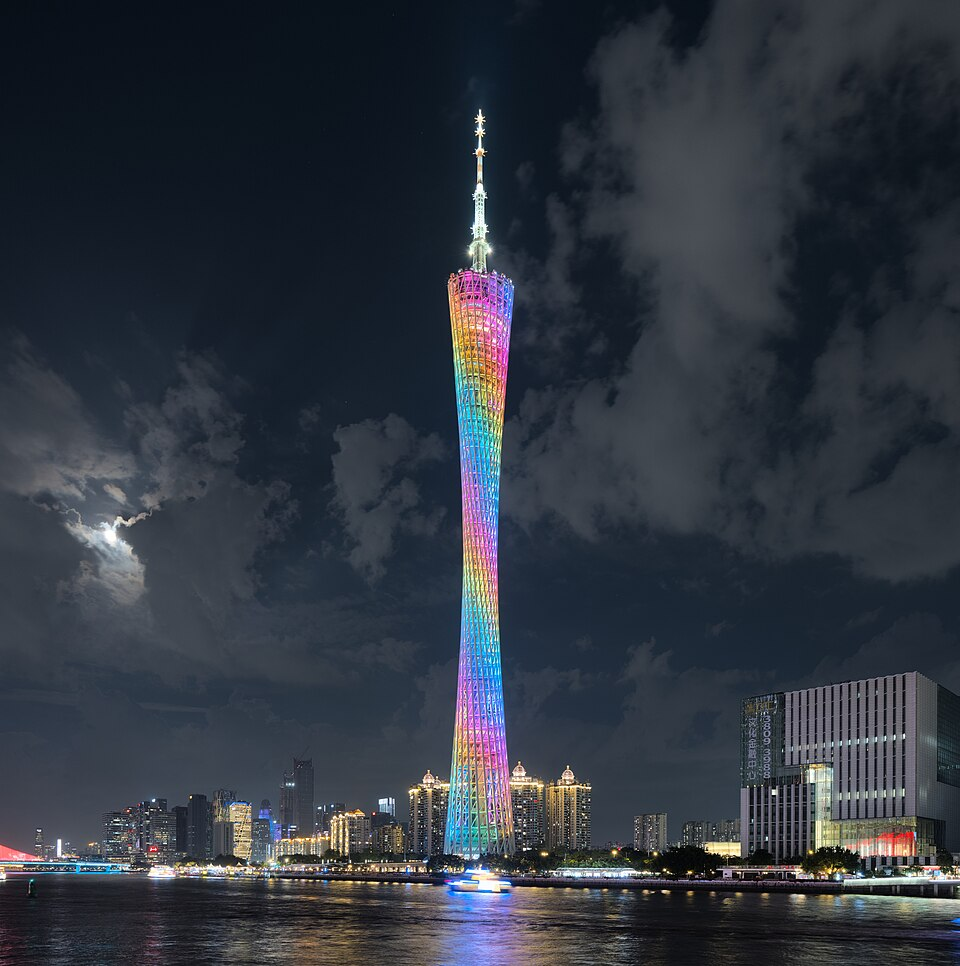
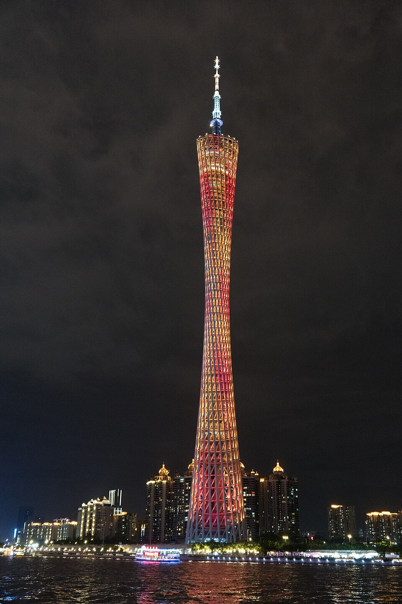
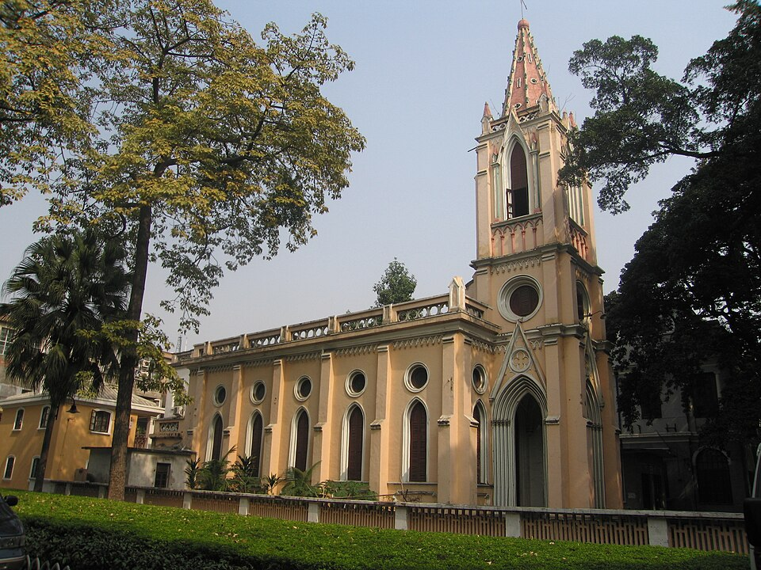
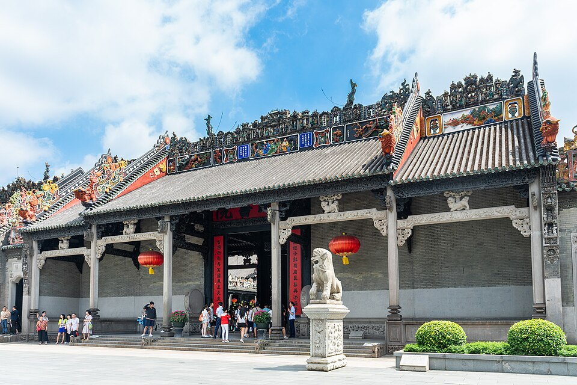
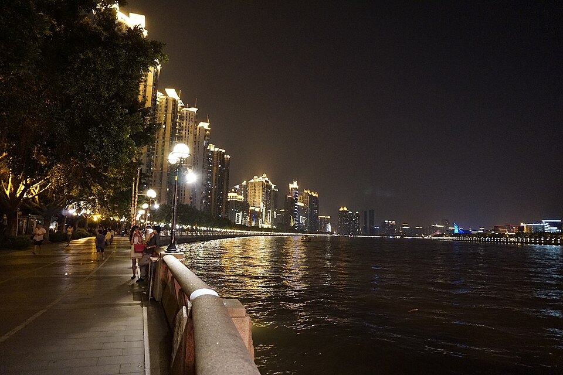
</div>

### 02.11 (пн) — 🌇 однодневка в Шэньчжэнь + 🛍 шоппинг

Сорок лет назад — рыбацкий уезд, сегодня — 17-миллионная витрина китайского хай-тека: один из самых плотных «лесов» небоскрёбов в мире, родина Huawei, Tencent и DJI. Ехать **налегке, с паспортами** (нужны при посадке): поезда с Гуанчжоу-Южного идут каждые 10–20 минут, ¥75, 35–40 минут.

- **~08:30** — Гуанчжоу-Южный → **Футянь** (福田站), к ~09:20 вы в центре шэньчжэньского CBD;
- **Ping An Finance Center — смотровая Free Sky.** 599-метровая доминанта города, один из пяти высочайших небоскрёбов мира; смотровая на 116-м этаже (~540 м). Утром меньше дымки и короче очередь;
- **Хуацянбэй** (Huaqiangbei · 华强北) — крупнейший рынок электроники в мире: целый квартал моллов с гаджетами, дронами, комплектующими и аксессуарами (SEG Plaza, Huaqiang Electronic World). Торговаться уместно. Здесь же — основной 🛍 шоппинг поездки;
- **холм Ляньхуашань** (Lianhua Hill · 莲花山) — лёгкий подъём ~20 минут и лучший «открыточный» вид на ось Футяня; наверху статуя Дэн Сяопина;
- по желанию **набережная Шэньчжэньского залива** или **Шекоу / Sea World** (蛇口 · 海上世界) — площадь вокруг океанского лайнера «Минхуа», фонтаны и рестораны;
- **возвращаемся с Шэньчжэнь-Северного** (深圳北站): поезда на Гуанчжоу-Южный ходят весь вечер.

> ⚠️ **Важная деталь про обратную дорогу.** С **Футяня** последний поезд на Гуанчжоу-Южный уходит уже около **19:10** — эта станция заточена под линию на Гонконг. Вечером возвращайтесь с **Шэньчжэнь-Северного** (深圳北), туда от Футяня 15 минут на метро (линия 4). Точное время последнего рейса проверьте утром того же дня.
> ⚠️ **Светового шоу небоскрёбов Футяня 2 ноября не будет** — синхронная подсветка башен идёт по выходным и праздникам, а это понедельник. Если шоу для вас принципиально, менять надо не день, а весь блок: приезжать в Гуанчжоу 31.10 и жертвовать днём в Яншо.
> 💡 **Альтернативный вход:** поезд **Гуанчжоу-Восточный → Шэньчжэнь (Лоху)** — дольше (~1 ч 15 м), но сам вокзал в Тяньхэ, ближе к центру Гуанчжоу, а Лоху — это **Дунмэнь** (东门步行街), самый демократичный по ценам пешеходный квартал.

<div class="gallery">
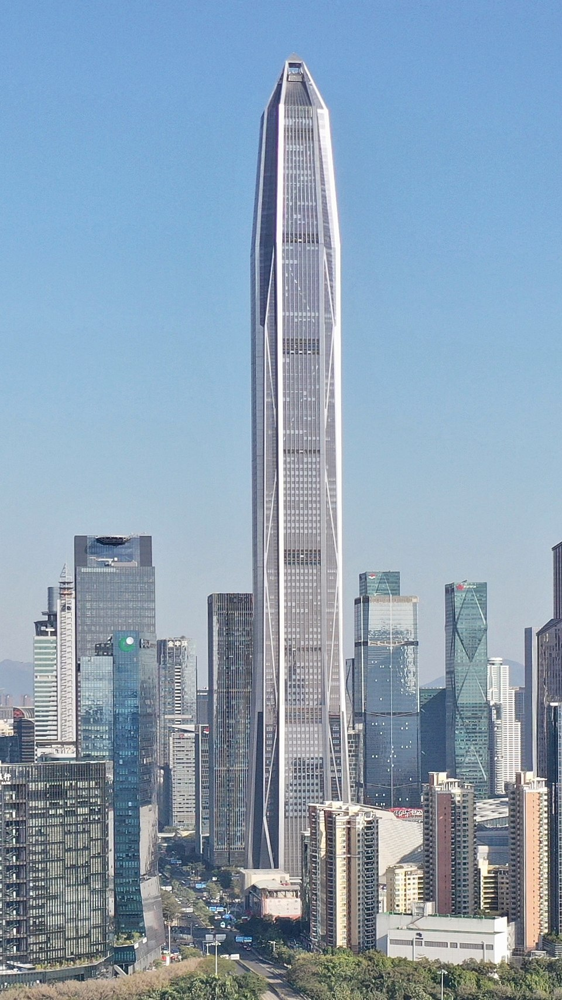
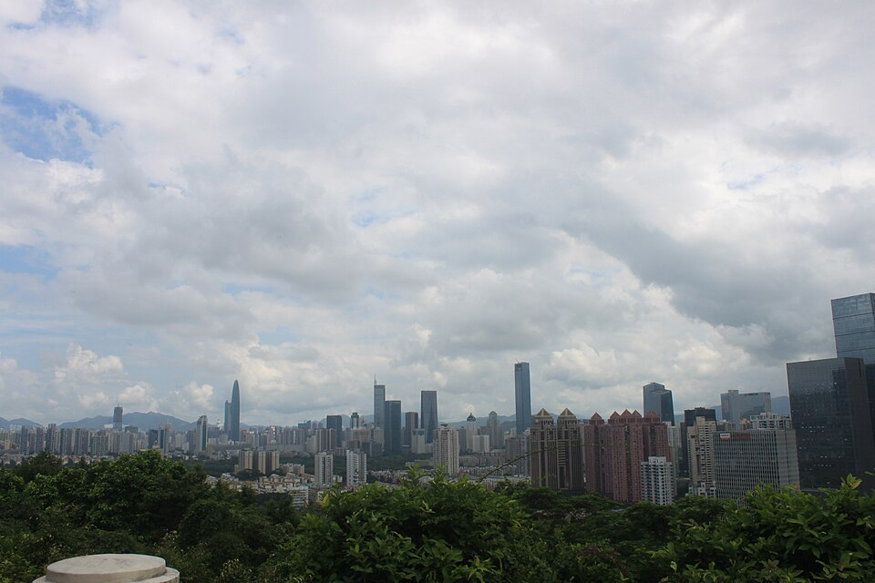
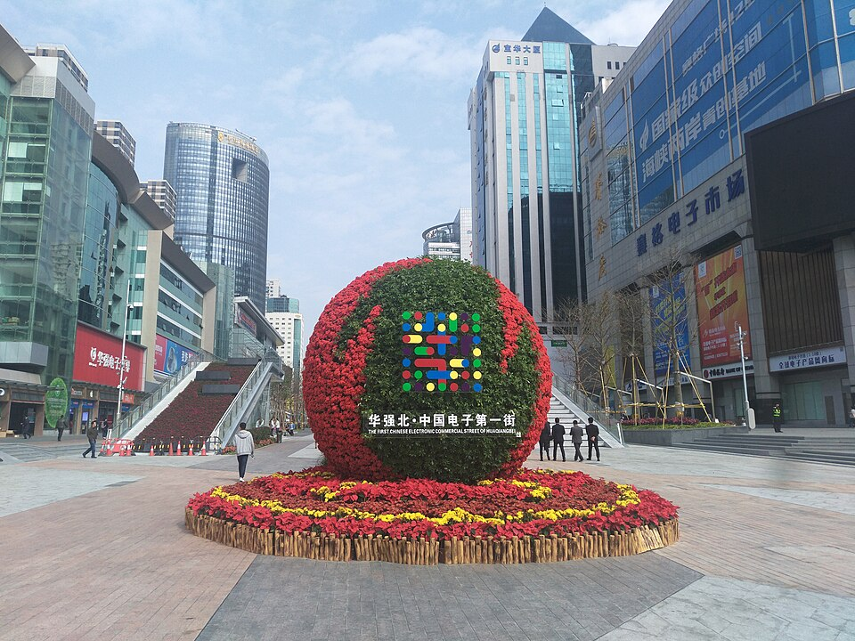
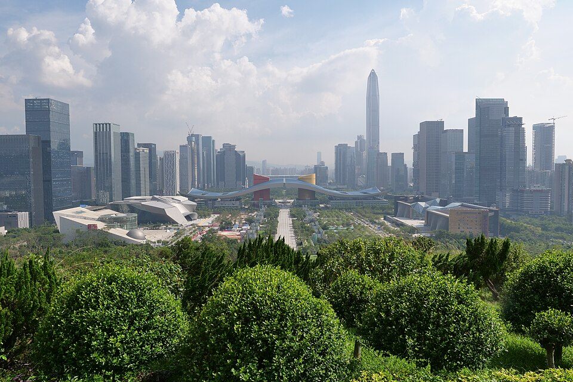
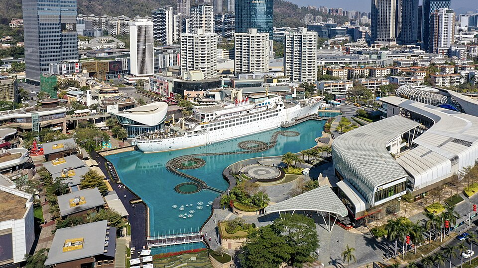
</div>

> 🛍 **Если Шэньчжэнь не нужен** — Гуанчжоу закрывает шоппинг сам: **Бэйцзин-лу** (北京路) со стеклянным «окном» в раскопанную древнюю мостовую, аркады **Шанся-цзю** (上下九), моллы Тяньхэ (Taikoo Hui, Grandview). А освободившийся день уйдёт на **Юэсю-парк** со «Пятью баранами» и утренний чай с дим-самом — это в Гуанчжоу отдельный вид спорта.
> <div class="gallery">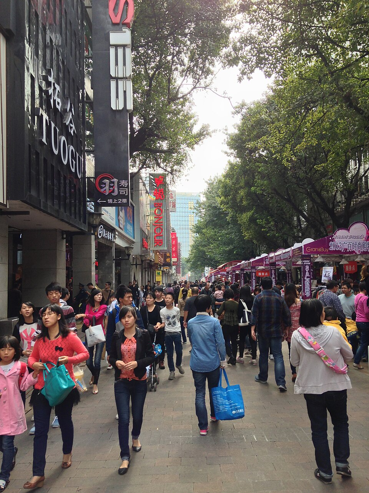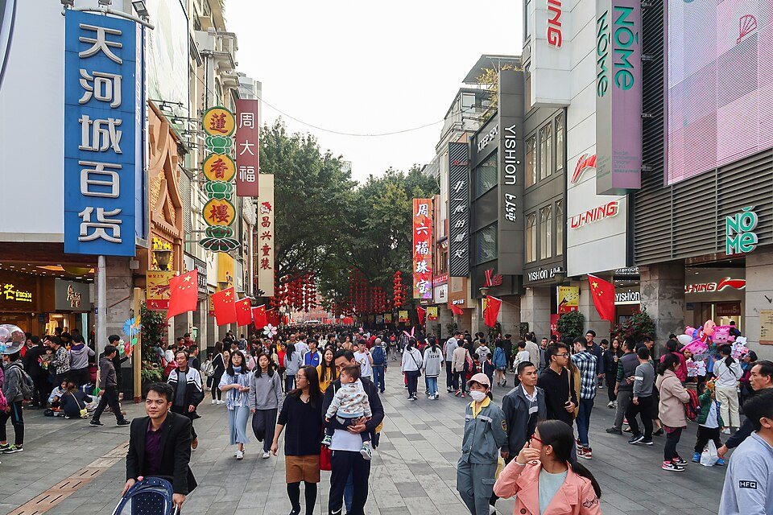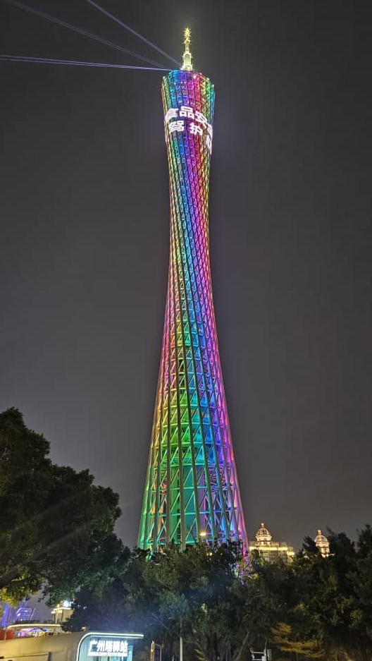</div>

### 03.11 (вт) — вылет из Гуанчжоу

Рейс в **13:35 из аэропорта Байюнь** (Guangzhou Baiyun · 广州白云国际机场, CAN) — самое спокойное утро за всю поездку:
- **~08:00** — завтрак: прощальный кантонский **утренний чай** (早茶) с дим-самом, в Гуанчжоу это делают лучше всех в мире;
- **~09:30** — выезд: **метро линия 3** до станции **机场南 / Airport South**, ~50–55 минут без пересадки на другую линию, ¥10;
- **~10:30** — в терминале, ~3 часа до вылета: регистрация, такс-фри, обед.

Все покупки — накануне в Шэньчжэне.

---

## ✈️ Возвращение — 3 ноября
- Утро: **Чжуцзян Нью-Таун → (метро, линия 3) → аэропорт Байюнь** (珠江新城 → 广州白云国际机场), ~1 ч от двери отеля.
- **13:35 — CZ8003** Гуанчжоу → Шереметьево, 12 ч 40 м с **техостановкой в Ухане** (Wuhan · 武汉; 1 ч 35 м, из самолёта, как правило, не выходим). **21:15 — дома.** ✅

---

## 💰 Бюджет на двоих (комфорт, без еды)

| Статья | Ориентир |
|--------|----------|
| Перелёты Москва → Чанде (через Пекин) // Гуанчжоу → Москва (2) | ~100–150 т₽ |
| Поезда: Чанде→Чжанцзяцзе, Фужунчжэнь ⇄, Чжанцзяцзе→Яншо, Яншо→Гуанчжоу, Гуанчжоу⇄Шэньчжэнь (2)<br>常德→张家界西 · 张家界西⇄芙蓉镇 · 张家界西→阳朔 · 阳朔→广州南 · 广州南⇄深圳 | ~18–26 т₽ |
| Такси/трансфер в день прилёта (аэропорт Чанде → вокзал → отель) | ~0.6–1 т₽ (или ~7–10 т₽ за прямой трансфер) |
| Отели, 10 ночей (вкл. «пустую» ночь 26.10 в городском отеле Чжанцзяцзе) | ~40–70 т₽ |
| Входные билеты (Улинъюань, Тяньмэнь, Стеклянный мост, Фужунчжэнь, Синпин, Impression, Ping An, Кантонская башня) | ~28–40 т₽ |
| **Итого (без еды и городского транспорта)** | **~187–297 т₽** |

💡 **Экономия:** перелёт с длинной стыковкой через Пекин заметно дешевле прямого — «плата» за это транзитный день 24.10 и поздний заезд; 2-й класс в поездах (комфортный); билеты в парки, на кораблики и смотровые — заранее через Trip.com/WeChat; апартаменты вместо отелей. Ночёвка в Фужунчжэне и лишний отель в Шэньчжэне из бюджета ушли, зато добавились Стеклянный мост и Кантонская башня — по деньгам примерно ничья, по нервам сильно легче.

---

## 📋 Мои бронирования

> Статус: 🔍 ищу · ⭐ кандидат · ✅ забронировано. Цены — за двоих.

### ✈️🚄 Транспорт
| # | Направление | Дата | Рейс/поезд | Цена (2) | Статус | Ссылка |
|:-:|------------|:----:|-----------|:-------:|:------:|--------|
| 1 | ✈️ Москва → Чанде (CGD) через Пекин<br>莫斯科 → 北京 → 常德 | 23–24.10 | 18:50 → 20:20 (+1), стыковка 10 ч 30 м | | ⭐ | `[открыть](url)` |
| 2 | 🚕 Аэропорт Чанде → вокзал Чанде<br>常德桃花源机场 → 常德站 | 24.10 (~20:45) | такси / заранее заказанный трансфер | | 🔍 | `[открыть](url)` |
| 3 | 🚄 Чанде → Чжанцзяцзе-Западный<br>常德 → 张家界西 | 24.10 (~22:21) | последний поезд, ~50 мин | | 🔍 | `[открыть](url)` |
| 4a | 🚄 Чжанцзяцзе-Западный → Фужунчжэнь<br>张家界西 → 芙蓉镇 | 28.10 (~14:30) | ~25 мин, ¥40/чел | | 🔍 | `[открыть](url)` |
| 4b | 🚄 Фужунчжэнь → Чжанцзяцзе-Западный<br>芙蓉镇 → 张家界西 | 28.10 (~21:30) | ⚠️ **последний поезд — проверить на 12306** | | 🔍 | `[открыть](url)` |
| 5 | 🚄 Чжанцзяцзе-Западный → Гуйлинь-Северный<br>张家界西 → 桂林北 | 29.10 (07:12) | **D3967**, прямой, ~7 ч, ¥342/чел | | 🔍 | `[открыть](url)` |
| 5' | 🚄 запасной: через Чанша-Южный<br>张家界西 → 长沙南 → 桂林北 | 29.10 (~08:30) | 2 пересадки, ~7–7.5 ч | | 🔍 | `[открыть](url)` |
| 6 | 🚄 Гуйлинь-Северный → Яншо<br>桂林北 → 阳朔 | 29.10 (день) | ~30 мин | | 🔍 | `[открыть](url)` |
| 7 | 🚄 Яншо → Гуанчжоу-Южный (прямой)<br>阳朔 → 广州南 | 01.11 (~09:00) | ~2–3 ч, ¥120–169/чел | | 🔍 | `[открыть](url)` |
| 8 | 🚄 Гуанчжоу-Южный ⇄ Шэньчжэнь<br>广州南 ⇄ 深圳北/福田 | 02.11 | туда на **Футянь**, обратно с **Шэньчжэнь-Северного** | | 🔍 | `[открыть](url)` |
| 9 | ✈️ Гуанчжоу (CAN) → Москва<br>广州 → 莫斯科 | 03.11 | CZ8003, 13:35 → 21:15 (через Ухань) | | ⭐ | `[открыть](url)` |

### 🏨 Жильё
| # | Город | Заезд → выезд | Ночей | Отель | Цена | Статус | Ссылка |
|:-:|-------|:-------------:|:-----:|-------|:----:|:------:|--------|
| 1 | 🏔 Чжанцзяцзе, город у канатки<br>Zhangjiajie · 张家界市区 | 24.10 → 29.10 | 5 | **бронь сплошная, включая ночь 26.10 в парке** · заезд ночью ~23:45 — предупредить отель! | | 🔍 | `[открыть](url)` |
| 2 | 🏔 Чжанцзяцзе, хоумстей внутри парка<br>Wulingyuan / Yuanjiajie · 武陵源 · 袁家界 | 26.10 → 27.10 | 1 | идём с рюкзаком, чемоданы в городском отеле | | 🔍 | `[открыть](url)` |
| 3 | 🏞 Яншо, у Западной улицы<br>Yangshuo West Street · 阳朔西街 | 29.10 → 01.11 | 3 | | | 🔍 | `[открыть](url)` |
| 4 | 🌆 Гуанчжоу, Чжуцзян Нью-Таун / у Кантонской башни<br>Guangzhou · 珠江新城 | 01.11 → 03.11 | 2 | метро линия 3 → аэропорт напрямую | | 🔍 | `[открыть](url)` |

### 🎟 Билеты заранее
| # | Что | Дата | Примечание | Статус |
|:-:|-----|:----:|-----------|:------:|
| 1 | Гора Тяньмэнь (канатка + стеклянные тропы) · 天门山 | 25.10 | таймслот на утро, брать накануне | 🔍 |
| 2 | Нацпарк Улинъюань · 武陵源 (~¥225, многодневный) | 26.10 | действует несколько дней | 🔍 |
| 3 | Большой каньон + Стеклянный мост · 大峡谷玻璃桥 | 28.10 | **строгий таймслот**, брать заранее | 🔍 |
| 4 | Фужунчжэнь · 芙蓉镇 (вход в городок) | 28.10 | можно на месте | 🔍 |
| 5 | Кораблик Яндти → Синпин · 杨堤 → 兴坪 | 31.10 | | 🔍 |
| 6 | Шоу Impression Sanjie Liu · 印象刘三姐 | 31.10 (вечер) | | 🔍 |
| 7 | Кантонская башня · 广州塔 (смотровая + Bubble Tram) | 01.11 (закат) | | 🔍 |
| 8 | Круиз по Жемчужной реке · 珠江夜游 | 01.11 (вечер) | | 🔍 |
| 9 | Ping An Free Sky · 平安金融中心云际观光 | 02.11 | | 🔍 |

> _Фото — Wikimedia Commons (папка `images/`), для визуализации локаций._
