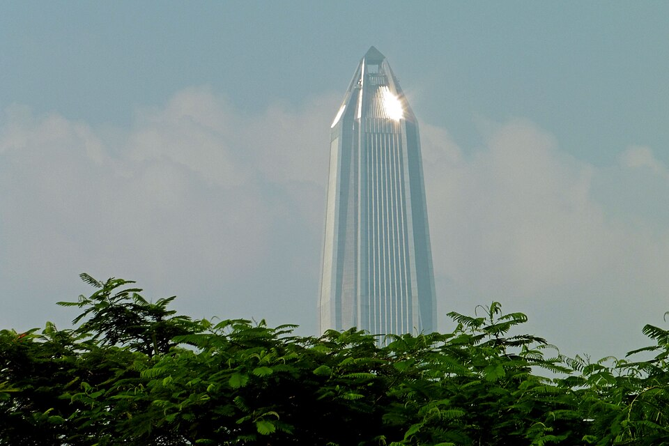
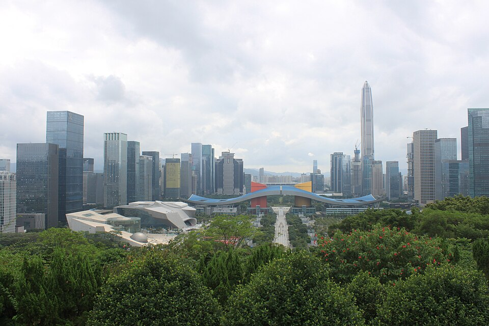
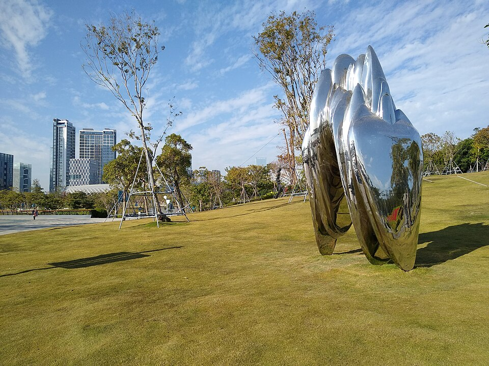
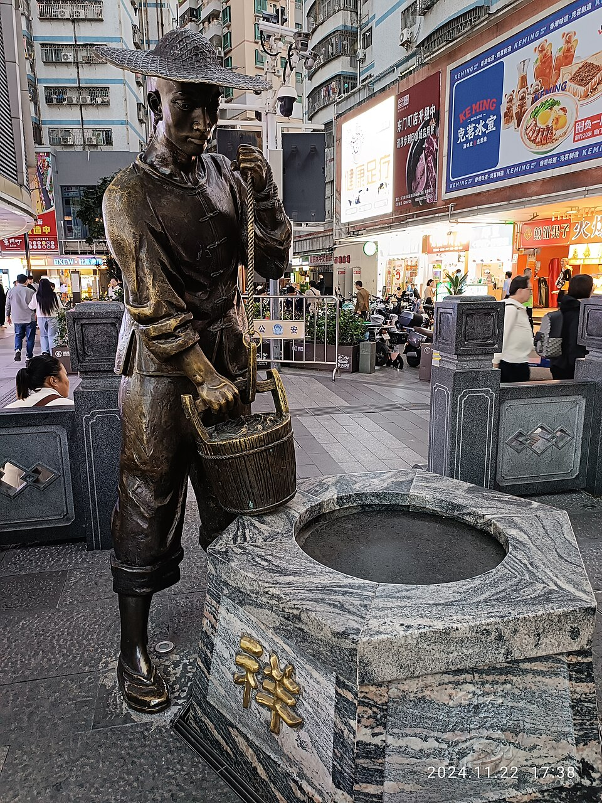

# 🇨🇳 Китай · Осень 2026 — Чжанцзяцзе · Яншо · Шэньчжэнь

**Даты:** вылет из Москвы вечером **23 октября** (21:15), в Китае **24 октября – 3 ноября**, дома **вечером 3 ноября** (19:15).
**Стиль:** сразу к главному — горы «Аватара», затем городок на водопаде, карстовые пейзажи реки Ли, а финал — витрина китайского хай-тека: небоскрёбы Шэньчжэня, залив и 🛍 шоппинг перед вылетом.
**Темп:** движемся с северо-запада на юго-восток, 2–3 ночи на базу, к концу поездки — всё спокойнее.

**Логистика:** прилёт в **Гуанчжоу** → в тот же день внутренний рейс в **Чжанцзяцзе** (аэропорт DYG прямо в городе) → поездами вниз: **Фужунчжэнь** → **Яншо** → **Шэньчжэнь** (прямой поезд) → утром в день вылета ~1.5 ч по скоростной ж/д до аэропорта Гуанчжоу → прямой рейс домой. Гуанчжоу — только транзитный хаб (пересадка на прилёте, аэропорт на вылете), город в программу не входит.

```
Москва ──✈── Гуанчжоу ──✈ ~1ч45м── Чжанцзяцзе ──🚄 ~35мин── Фужунчжэнь ──🚄 ~3ч── Яншо ──🚄 ~3ч── Шэньчжэнь ──🚄+🚋 ~1.5ч── аэропорт Гуанчжоу ──✈── Москва
```

| База | Ночей | Зачем |
|------|:----:|-------|
| 🏔 Чжанцзяцзе | 3 (24–27.10) | Гора Тяньмэнь + горы «Аватара», ночь внутри парка |
| 🏮 Фужунчжэнь | 1 (27–28.10) | Городок туцзя «на водопаде», ночная подсветка |
| 🏞 Яншо | 3 (28–31.10) | Река Ли, карст, бамбуковые плоты |
| 🌇 Шэньчжэнь | 3 (31.10–03.11) | Небоскрёбы Футяня, залив, Хуацянбэй + 🛍 шоппинг напоследок |

---

## ⚠️ Перед поездкой — коротко

- **Виза не нужна** (безвиз для РФ продлён до 31.12.2027, до 30 дней). Загранпаспорт со сроком +6 мес.
- **Оплата:** поставьте **Alipay** и **WeChat Pay**, привяжите карту — наличные почти не нужны. Российские карты напрямую не работают.
- **Интернет:** Google/Instagram/WhatsApp/YouTube заблокированы. Заранее купите **eSIM** или возьмите рабочий **VPN** ещё в России. Карты — **Amap**.
- **Погода:** **в горах Чжанцзяцзе холодно** — у вершин ночью близко к 0 °C, тёплый слой + дождевик обязательны. Дальше теплеет: Яншо ~15–24 °C, Шэньчжэнь в начале ноября ~21–28 °C — самый комфортный сезон.
- **Поезда, внутренний перелёт и билеты в парки** берите за 2–4 недели через Trip.com (по загранпаспорту).

> 💡 Сканы паспортов для бронирований давайте только проверенным площадкам — это обработка ПДн (152-ФЗ).

---

## ✈️🚄 Транспорт между базами

| Плечо | Дата | Как | Время | Ориентир (2 чел.) |
|-------|:----:|-----|:-----:|:-----------------:|
| ✈️ Москва → Гуанчжоу (CAN) | 23–24.10 | **CZ656** (China Southern, прямой, A350): SVO 21:15 → CAN 11:40 (+1) | 9 ч 25 м | в составе multi-city* |
| ✈️ Гуанчжоу → Чжанцзяцзе (DYG) | 24.10 | внутренний рейс China Southern, ~19:05 → 20:50 (летает по вт/чт/**сб** — 24.10 суббота ✓); стыковка ~7 ч — с запасом | 1 ч 45 м | в составе multi-city* |
| 🚄 Чжанцзяцзе-Запад → Фужунчжэнь | 27.10 | поезд «G» (день) | ~35 мин | ~1.5–2.5 т₽ |
| 🚄 Фужунчжэнь → Яншо | 28.10 | поезд «G», пересадка в Гуйлине | ~3–3.5 ч | ~5–8 т₽ |
| 🚄 Яншо → Шэньчжэнь-Север | 31.10 | **прямой** поезд «G» (напр. G3741 10:20 → 13:23; прямых всего 4 в день — брать заранее) | ~3 ч | ~6–8 т₽ |
| 🚄 Шэньчжэнь (Футянь) → Гуанчжоу-Южный | 03.11 (утро) | поезда «G»/«C» каждые 10–20 мин | 35–40 мин | ~2 т₽ |
| 🚋 Гуанчжоу-Южный → аэропорт Байюнь (T2/T3) | 03.11 | междугородняя линия **Дунхуань** (Donghuan), каждые ~15 мин | ~30 мин | ~0.5 т₽ |
| ✈️ Гуанчжоу (CAN) → Москва | 03.11 | **CZ655** (прямой): CAN 13:50 → SVO 19:15 | 10 ч 25 м | в составе multi-city* |

> *Единый **multi-city** билет «Москва → Гуанчжоу → Чжанцзяцзе // Гуанчжоу → Москва», всё — China Southern: и багаж, и ответственность за стыковку в одних руках.
> ⚠️ Рейс CAN→DYG летает не ежедневно, а CZ655 — 4 раза в неделю: **при покупке сверьте дни выполнения** на 24.10 и 03.11. План Б на прилёт — скоростной поезд Гуанчжоу-Южный → Чжанцзяцзе-Запад (~6 ч, тогда первая ночь в Гуанчжоу у вокзала). Если на прямой поезд Яншо → Шэньчжэнь мест нет — любой поезд до Гуанчжоу-Южного + пересадка (на Шэньчжэнь поезда каждые 10–15 мин).
> 🔎 [Trip.com Авиа](https://ru.trip.com/flights/) · [Trip.com Поезда](https://ru.trip.com/trains/) · [Aviasales](https://www.aviasales.ru/)

---

# 🗓 Маршрут одним взглядом

| День | Дата | Город | Что смотрим | Кратко о дне |
|:---:|:----:|-------|-------------|--------------|
| 0 | 23.10 пт | Москва ✈️ | — | 21:15 вылет CZ656 (прямой, 9 ч 25 м, +5 ч к Москве) |
| 1 | 24.10 сб | Гуанчжоу ✈ 🏔 Чжанцзяцзе | транзит | 11:40 прилёт; вечером внутренний рейс, к 21:30 — в отеле Чжанцзяцзе |
| 2 | 25.10 вс | 🏔 Чжанцзяцзе | гора Тяньмэнь | самая длинная канатка мира, стеклянные тропы, «Небесные врата» |
| 3 | 26.10 пн | 🏔 Чжанцзяцзе | Юаньцзяцзе · лифт Байлун | горы «Аватара» и мост «Первый под небом»; ночь внутри парка |
| 4 | 27.10 вт | 🏔 → 🏮 Фужунчжэнь | Тяньцзы · Золотой кнут · переезд | с утра панорамы «леса пиков», днём поезд ~35 мин; вечером ночной водопад |
| 5 | 28.10 ср | 🏮 → 🏞 Яншо | Фужунчжэнь утром · переезд | городок без толп; поезд ~3 ч (перес. Гуйлинь); вечером Западная улица |
| 6 | 29.10 чт | 🏞 Яншо | река Юйлун · Луна-гора | бамбуковый плот в утренней дымке, велосипед, арка-«полумесяц» |
| 7 | 30.10 пт | 🏞 Яншо | Синпин · холм Сянгун · шоу Impression | кораблик по «виду с ¥20», закат над излучиной Ли, вечером шоу на воде |
| 8 | 31.10 сб | 🚄 → 🌇 Шэньчжэнь | переезд · вечер на высоте | прямой поезд ~3 ч; закат на смотровой Ping An, вечером световое шоу Футяня |
| 9 | 01.11 вс | 🌇 Шэньчжэнь | Ляньхуашань · залив · Шекоу | панорама CBD с холма, променад Шэньчжэньского залива, вечером Sea World |
| 10 | 02.11 пн | 🌇 Шэньчжэнь | 🛍 шоппинг | Хуацянбэй (электроника), моллы Футяня, Дунмэнь |
| 11 | 03.11 вт | Шэньчжэнь → ✈️ Гуанчжоу → Москва | — | 07:30 выезд: поезд + Дунхуань до CAN; 13:50 прямой CZ655, 19:15 — дома ✅ |

---

# 📅 Маршрут по дням

## День 0 — 23.10 (пт): вылет из Москвы
**21:15 — CZ656 (China Southern), Шереметьево → Гуанчжоу**, прямой, в полёте 9 ч 25 м. Разница с Москвой **+5 часов** — прилёт 24.10 в 11:40 по местному.

---

## 🏔 ЧЖАНЦЗЯЦЗЕ — 24–27 октября

«Те самые горы Аватара»: тысячи песчаниковых столбов в тумане, плюс гора Тяньмэнь с «Небесными вратами». Начинаем с главного — пока ноги свежие, а впечатления не «замылены».
**Тактика:** первые 2 ночи — в городе (у нижней станции канатки Тяньмэнь), ночь 26-го — **внутри парка** (Юаньцзяцзе), чтобы к 7 утра быть у смотровых — без очередей и с туманом. Вход в нацпарк ~¥225, действует несколько дней.

### 24.10 (сб) — день перелётов

**11:40 — прилёт в Гуанчжоу (CAN)**. Паспортный контроль, багаж, регистрация на внутренний рейс — времени с запасом (~7 ч): можно пообедать в аэропорту и выдохнуть. **~19:05 — рейс в Чжанцзяцзе (DYG)**, 1 ч 45 м. Аэропорт Хэхуа — практически в городе (15–20 мин до отеля). К ~21:30 — заселение и сон: завтра горы.

### 25.10 (вс) — гора Тяньмэнь

**Гора Тяньмэнь (Tianmen)**
Самая длинная пассажирская канатка мира (~7.5 км) стартует прямо из центра города и ведёт на вершину; вдоль обрыва — **стеклянные тропы**, а серпантин «98 поворотов» уходит к пещере-арке **«Небесные врата»** (131 м в скале), к которой поднимаются 999 ступеней. Захватывает дух даже у бывалых. Целый день без спешки: очереди на канатку — главный «расход» времени, идите к открытию.
<div class="gallery">


</div>

### 26.10 (пн) — нацпарк, горы «Аватара»

**Юаньцзяцзе (Yuanjiajie)** + лифт Байлун
С утра переезжаем ко входу в нацпарк Улинъюань. Плато с легендарной «парящей горой Аллилуйя» — прообразом летающих гор «Аватара» — и мостом «Первый под небом». Наверх поднимает **стеклянный лифт Байлун** — 326 м вдоль отвесной скалы (самый высокий открытый лифт мира). Море каменных пиков в облаках.
<div class="gallery">


</div>
Ночь в **хоумстее внутри парка** — утром будете у смотровых первыми.

### 27.10 (вт) — Тяньцзы, днём → Фужунчжэнь

**Гора Тяньцзы (Tianzi) + Золотой кнут**
Ранний подъём на **Тяньцзы** — лучшие панорамы «леса пиков» (смотровые Хэлун, «Письмо с небес»). Спуск к **ручью Золотого кнута (Golden Whip Stream)** — лёгкая прогулка по дну ущелья вдоль реки, скал и любопытных макак. После обеда — на вокзал Чжанцзяцзе-Запад и короткий поезд (~35 мин) в Фужунчжэнь.

**По желанию: Большой каньон + Стеклянный мост**
Самый длинный и высокий стеклянный мост в мире (430 м длиной, 300 м над дном каньона). Отдельный билет; поместится, только если сократить Тяньцзы — к вечеру нужно успеть на поезд.

<div class="gallery">


</div>

---

## 🏮 ФУЖУНЧЖЭНЬ — 27–28 октября (1 ночь)

Древний городок народности **туцзя** (~2000 лет), «висящий на водопаде»: дома на сваях стоят прямо над 60-метровым каскадом Ванцунь. Прославился по фильму «Городок Хибискус» (1986). Главное зрелище — **вечером**, когда водопад и весь ярусный городок подсвечены; днём туристов много, а ночью и ранним утром он ваш.
**Где жить:** гостевой дом с видом на водопад (их много прямо над обрывом).

### 27.10 (вт) вечер → утро 28.10 (ср)

От станции **Furongzhen** до городка ~10 км (такси/автобус 15–20 мин). Заселение — и сразу на смотровые: **ночная подсветка водопада** и улочек, «золотой» городок над чёрной водой. Утром 28-го — мощёная главная улица без толп (попробуйте фирменный **рисовый тофу мидоуфу**), тропа проходит прямо **за стеной водопада**, внизу — пристань и виды на реку Юшуй. К обеду — на станцию и поезд на юг.
<div class="gallery">


</div>

---

## 🏞 ЯНШО — 28–31 октября

Открыточный карст: тысячи зелёных холмов-«пальцев» над изумрудной рекой Ли — пейзаж с купюры в 20 юаней. После гор — смена ритма: велосипед, бамбуковые плоты, ленивые вечера.
**Где жить:** в **Яншо** у Западной улицы, 3 ночи. Станция скоростной ж/д Яншо — ~40 мин от городка (такси/шаттл).

### 28.10 (ср) — переезд + вечер на Западной улице

Днём поезд Фужунчжэнь → Яншо с пересадкой в Гуйлине (суммарно ~3–3.5 ч), трансфер в город ~40 мин. К ~17:00 — заселение.

**Западная улица (West Street / Сицзе)**
Главная пешеходная артерия Яншо — 1500 лет истории, сотни лавок, мастерских и кафе. Идеальный вечер дня переезда: поужинать, надышаться атмосферой, приглядеть чай (гуанси-чёрный, пуэр), шёлк, батик и веера — купить успеете в любой из вечеров.
<div class="gallery">


</div>

### 29.10 (чт) — река Юйлун + Луна-гора

**Бамбуковый плот по реке Юйлун (Yulong)**
Тихий приток без круизных теплоходов: неспешный сплав на бамбуковом плоту мимо рисовых полей, древних каменных мостов и холмов. Лучше всего утром, в дымке. Рядом отлично идёт прокат велосипеда по окрестным деревням.

**Луна-гора (Moon Hill)**
Холм со сквозной аркой-«полумесяцем»: по мере обхода арка «превращается» из полной луны в серп. Подъём ~800 ступеней к арке, сверху — панорама долины. Рядом — район скалолазания.

<div class="gallery">


</div>

### 30.10 (пт) — Синпин, Сянгун + вечернее шоу

**Синпин (Xingping) и «вид с ¥20»**
Вместо полного круиза из Гуйлиня (теплоходы идут только по течению) — из Яншо в древний городок **Синпин** (~40 мин), оттуда кораблик или плот по самому красивому участку реки Ли **Яндти → Синпин**: рыбаки на плотах, буйволы у воды и тот самый пейзаж с 20-юаневой банкноты. Дешевле и короче большого круиза, а виды — те же.

**Холм Сянгун (Xianggong Hill)**
Лучшая обзорная точка на излучину реки Ли — короткий, но крутой подъём ~20 минут, сверху «те самые» фото Гуйлиня. По дороге из Синпина; красивее всего в косом вечернем свете или на рассвете.

**Шоу «Impression Sanjie Liu» (вечер)**
Грандиозное ночное представление режиссёра **Чжана Имоу** прямо на воде реки Ли: сцена — 2 км реки и 12 подсвеченных холмов, в шоу заняты сотни местных рыбаков. Свет, музыка и природный «задник» — must-see вечера в Яншо.

<div class="gallery">


</div>

> 💡 Рисовые террасы **Лунцзи** (полный день от Гуйлиня) в маршрут не помещаются. Если они принципиальны — можно пожертвовать рекой Юйлун 29.10.

---

## 🌇 ШЭНЬЧЖЭНЬ — 31 октября – 3 ноября

Сорок лет назад — рыбацкий уезд, сегодня — 17-миллионная витрина китайского хай-тека: один из самых плотных «лесов» небоскрёбов в мире, родина Huawei, Tencent и DJI. В начале ноября ~21–28 °C — бархатный сезон.
**Где жить:** район **Футянь (Futian CBD)** — небоскрёбы и моллы под боком, а скоростной вокзал **Футянь** прямо под центром: утром в день вылета — вниз на эскалаторе и сразу на поезд в аэропорт Гуанчжоу.

### 31.10 (сб) — переезд + вечер на высоте

Утром **прямой поезд Яншо → Шэньчжэнь-Север** (G3741, 10:20 → 13:23, ~3 ч), метро 2–3 остановки до Футяня, заселение к ~15:00.

**Ping An Finance Center — смотровая Free Sky**
599-метровая доминанта города, один из пяти высочайших небоскрёбов мира; смотровая **Free Sky** на 116-м этаже (~540 м). Приходите за час до заката — увидите город при свете, в сумерках и в неоне. Внизу — молл и подземный «город» Link City.

**Световое шоу Футяня** — вечером
По выходным (~19:30) десятки башен CBD превращаются в единый экран: синхронная светоанимация на фасадах вокруг площади Гражданского центра. 31.10 — суббота, шоу в графике ✓; лучшие точки — сама площадь или холм Ляньхуашань.

<div class="gallery">




</div>

### 01.11 (вс) — парки, залив и Шекоу

**Холм Ляньхуашань (Lianhua Hill)**
Лёгкий подъём ~20 минут — и лучший «открыточный» вид на ось Футяня: Гражданский центр с волнообразной крышей, Ping An и весь лес башен. Наверху — статуя Дэн Сяопина, «отца» шэньчжэньского чуда.

**Шэньчжэньский залив: Talent Park и променад**
Многокилометровая набережная вдоль залива: пальмы, велодорожки, арт-объекты, а через воду — холмы Гонконга. Лучшее время — вторая половина дня и закат.

**Шекоу / Sea World** — вечером
Площадь вокруг настоящего океанского лайнера «Минхуа»: фонтаны, рестораны всех кухонь мира, вечерняя подсветка — сюда на ужин.

> 💡 По желанию: арт-кластер **OCT-LOFT** (галереи и кофейни в бывших фабриках) или деревня художников **Дафэнь** — если захочется сменить стекло и сталь на богему.

<div class="gallery">



</div>

### 02.11 (пн) — 🛍 шоппинг

Целый день на покупки напоследок — Шэньчжэнь в этом жанре не уступает никому:
- **Хуацянбэй (Huaqiangbei)** — крупнейший рынок электроники в мире: целый квартал моллов с гаджетами, дронами, комплектующими и аксессуарами (SEG Plaza, Huaqiang Electronic World). Торговаться уместно.
- **Моллы Футяня** — **MixC** (люкс), **COCO Park** и подземный **Link City** — всё в шаговой доступности от отеля.
- **Дунмэнь (Dongmen)** — старейший пешеходный квартал в Лоху: местные марки, обувь и уличная еда — самые демократичные цены.
- Съедобные подарки: чай, сладости и соусы — супермаркеты Ole'/blt в моллах.

Вечером — прощальный ужин: кантонская классика или морепродукты в Шекоу.
<div class="gallery">


</div>

### 03.11 (вт) — вылет из Гуанчжоу

Рейс в **13:50 из аэропорта Байюнь (CAN)** — утро по чёткому графику, но без гонки:
- **~07:30** — выезд из отеля (вокзал Футянь под боком);
- **~07:45–08:25** — поезд **Футянь → Гуанчжоу-Южный** (ходят каждые 10–20 мин, 35–40 мин);
- пересадка ~30 мин (повторный досмотр) → **междугородняя линия Дунхуань** до аэропорта: ~30 мин, каждые ~15 мин, прибытие прямо под терминалы;
- **к ~09:45–10:15 — в Байюне**: почти 4 часа до вылета, запас на регистрацию и такс-фри.

Все покупки — накануне.

---

## ✈️ Возвращение — 3 ноября
- Утро: **Футянь → Гуанчжоу-Южный → (Дунхуань) → аэропорт Байюнь**, суммарно ~2–2.5 ч от двери отеля.
- **13:50 — CZ655** Гуанчжоу → Шереметьево, **прямой**, 10 ч 25 м. **19:15 — дома, ещё вечер в запасе.** ✅

---

## 💰 Бюджет на двоих (комфорт, без еды)

| Статья | Ориентир |
|--------|----------|
| Перелёты Москва↔Китай + Гуанчжоу→Чжанцзяцзе (multi-city, 2) | ~120–180 т₽ |
| Поезда (Чжанцзяцзе→Фужунчжэнь→Яншо→Шэньчжэнь→аэропорт Гуанчжоу, 2) | ~15–22 т₽ |
| Отели/апартаменты, 10 ночей | ~40–70 т₽ |
| Входные билеты (Чжанцзяцзе, Тяньмэнь, Фужунчжэнь, Синпин, шоу, смотровая Ping An) | ~24–34 т₽ |
| **Итого (без еды и городского транспорта)** | **~200–305 т₽** |

💡 **Экономия:** multi-city одним билетом; 2-й класс в поездах (комфортный); билеты в парки и на кораблики — заранее через Trip.com/WeChat; апартаменты вместо отелей.

---

## 📋 Мои бронирования

> Статус: 🔍 ищу · ⭐ кандидат · ✅ забронировано. Цены — за двоих.

### ✈️🚄 Транспорт
| # | Направление | Дата | Рейс/поезд | Цена (2) | Статус | Ссылка |
|:-:|------------|:----:|-----------|:-------:|:------:|--------|
| 1 | ✈️ Москва → Гуанчжоу (CAN) | 23–24.10 | CZ656, 21:15 → 11:40 (+1) | | ⭐ | `[открыть](url)` |
| 2 | ✈️ Гуанчжоу → Чжанцзяцзе (DYG) | 24.10 | CZ, ~19:05 → 20:50 (сверить день!) | | ⭐ | `[открыть](url)` |
| 3 | 🚄 Чжанцзяцзе-Запад → Фужунчжэнь | 27.10 (день) | | | 🔍 | `[открыть](url)` |
| 4 | 🚄 Фужунчжэнь → Яншо (перес. Гуйлинь) | 28.10 (день) | | | 🔍 | `[открыть](url)` |
| 5 | 🚄 Яншо → Шэньчжэнь-Север (прямой) | 31.10 (утро) | G3741, 10:20 → 13:23 | | 🔍 | `[открыть](url)` |
| 6 | 🚄 Футянь → Гуанчжоу-Южный | 03.11 (~07:45) | | | 🔍 | `[открыть](url)` |
| 7 | 🚋 Гуанчжоу-Южный → аэропорт Байюнь (Дунхуань) | 03.11 (~08:45) | | | 🔍 | `[открыть](url)` |
| 8 | ✈️ Гуанчжоу (CAN) → Москва | 03.11 | CZ655, 13:50 → 19:15 (сверить день!) | | ⭐ | `[открыть](url)` |

### 🏨 Жильё
| # | Город | Заезд → выезд | Ночей | Отель | Цена | Статус | Ссылка |
|:-:|-------|:-------------:|:-----:|-------|:----:|:------:|--------|
| 1 | 🏔 Чжанцзяцзе (город, у канатки) | 24.10 → 26.10 | 2 | | | 🔍 | `[открыть](url)` |
| 2 | 🏔 Чжанцзяцзе (внутри парка) | 26.10 → 27.10 | 1 | | | 🔍 | `[открыть](url)` |
| 3 | 🏮 Фужунчжэнь (вид на водопад) | 27.10 → 28.10 | 1 | | | 🔍 | `[открыть](url)` |
| 4 | 🏞 Яншо (у Западной улицы) | 28.10 → 31.10 | 3 | | | 🔍 | `[открыть](url)` |
| 5 | 🌇 Шэньчжэнь (Футянь, у вокзала / COCO Park) | 31.10 → 03.11 | 3 | | | 🔍 | `[открыть](url)` |

> _Фото — Wikimedia Commons (папка `images/`), для визуализации локаций._
