# 🇨🇳 Китай · Осень 2026 — Яншо · Чжанцзяцзе · Чунцин

**Даты:** вылет из Москвы вечером **23 октября** (21:15), в Китае **24 октября – 3 ноября**, дома **вечером 3 ноября** (21:15).
**Стиль:** карстовые пейзажи реки Ли → городок на водопаде → горы «Аватара» → киберпанк-мегаполис. Финал — неон и шоппинг Чунцина.
**Темп:** движемся с юго-востока на северо-запад, 2–4 ночи на базу, минимум «однодневных» ночёвок.

**Логистика (open-jaw):** прямой рейс в **Гуанчжоу** → сразу поезд в **Яншо** (ночь в Гуанчжоу не нужна) → по пути ночь в **Фужунчжэне** → **Чжанцзяцзе** → **Чунцин** (шоппинг напоследок) → вылет домой из Чунцина. В одну точку не возвращаемся, всё по одной ж/д цепочке — без крюков.

```
Москва ──✈── Гуанчжоу ──🚄 ~2.5ч── Яншо ──🚄 ~3ч── Фужунчжэнь ──🚄 ~35мин── Чжанцзяцзе ──🚄 ~2ч── Чунцин ──✈── Москва
```

| База | Ночей | Зачем |
|------|:----:|-------|
| 🏞 Яншо | 3 (24–27.10) | Река Ли, карст, бамбуковые плоты |
| 🏮 Фужунчжэнь | 1 (27–28.10) | Городок туцзя «на водопаде», ночная подсветка |
| 🏔 Чжанцзяцзе | 2 (28–30.10) | Горы «Аватара» + Тяньмэнь |
| 🌃 Чунцин | 4 (30.10–03.11) | Город-киберпанк + 🛍 шоппинг напоследок |

---

## ⚠️ Перед поездкой — коротко

- **Виза не нужна** (безвиз для РФ продлён до 31.12.2027, до 30 дней). Загранпаспорт со сроком +6 мес.
- **Оплата:** поставьте **Alipay** и **WeChat Pay**, привяжите карту — наличные почти не нужны. Российские карты напрямую не работают.
- **Интернет:** Google/Instagram/WhatsApp/YouTube заблокированы. Заранее купите **eSIM** или возьмите рабочий **VPN** ещё в России. Карты — **Amap**.
- **Погода в конце октября:** Яншо/Чунцин ~15–24 °C, влажно; **в горах Чжанцзяцзе холодно**, у вершин ночью близко к 0 °C. Тёплый слой + дождевик обязательны.
- **Поезда и билеты в парки** берите за 2–4 недели через Trip.com (по загранпаспорту).

> 💡 Сканы паспортов для бронирований давайте только проверенным площадкам — это обработка ПДн (152-ФЗ).

---

## ✈️🚄 Транспорт между базами

| Плечо | Дата | Как | Время | Ориентир (2 чел.) |
|-------|:----:|-----|:-----:|:-----------------:|
| ✈️ Москва → Гуанчжоу (CAN) | 23–24.10 | **CZ656** (China Southern, прямой, A350): SVO 21:15 → CAN 11:40 (+1) | 9 ч 25 м | в составе open-jaw* |
| 🚄 Гуанчжоу-Южный → Яншо | 24.10 | поезд «G» (брать на ≥16:00 — запас после прилёта) | ~2.5 ч | ~4–7 т₽ |
| 🚄 Яншо → Фужунчжэнь | 27.10 | поезд «G», пересадка в Гуйлине | ~3–3.5 ч | ~5–8 т₽ |
| 🚄 Фужунчжэнь → Чжанцзяцзе-Запад | 28.10 | поезд «G» | ~35 мин | ~1.5–2.5 т₽ |
| 🚄 Чжанцзяцзе → Чунцин | 30.10 | поезд «G» (вечером) | 2–2.5 ч | ~5–9 т₽ |
| ✈️ Чунцин (CKG) → Москва | 03.11 | **CZ5754 + CZ8003** через Ухань: CKG 11:40 → WUH 13:10 · стыковка 3 ч 55 м (багаж сквозной) · WUH 17:05 → SVO 21:15 | 14 ч 35 м | в составе open-jaw* |

> *Единый **multi-city** билет «Москва → Гуанчжоу // Чунцин → Москва», всё — China Southern.
> 🔎 [Trip.com Авиа](https://ru.trip.com/flights/) · [Trip.com Поезда](https://ru.trip.com/trains/) · [Aviasales](https://www.aviasales.ru/)

---

# 🗓 Маршрут одним взглядом

| День | Дата | Город | Что смотрим | Кратко о дне |
|:---:|:----:|-------|-------------|--------------|
| 0 | 23.10 пт | Москва ✈️ | — | 21:15 вылет CZ656 (прямой, 9 ч 25 м, +5 ч к Москве) |
| 1 | 24.10 сб | Гуанчжоу → 🏞 Яншо | переезд | 11:40 прилёт; метро на вокзал, поезд ~16:30 (~2.5 ч); вечером Западная улица |
| 2 | 25.10 вс | 🏞 Яншо | река Юйлун · Луна-гора | бамбуковый плот в утренней дымке, велосипед, арка-«полумесяц» |
| 3 | 26.10 пн | 🏞 Яншо | Синпин · холм Сянгун · шоу Impression | кораблик по «виду с ¥20», закат над излучиной Ли, вечером шоу на воде |
| 4 | 27.10 вт | 🚄 → 🏮 Фужунчжэнь | переезд · ночной водопад | поезд ~3 ч (пересадка в Гуйлине); вечером подсветка городка |
| 5 | 28.10 ср | 🏮 → 🏔 Чжанцзяцзе | Фужунчжэнь утром · гора Тяньмэнь | городок без толп; днём поезд ~35 мин, после обеда канатка и «Небесные врата» |
| 6 | 29.10 чт | 🏔 Чжанцзяцзе | Юаньцзяцзе · лифт Байлун | горы «Аватара» и мост «Первый под небом»; ночь внутри парка |
| 7 | 30.10 пт | 🏔 → 🌃 Чунцин | Тяньцзы · Золотой кнут | панорамы «леса пиков»; вечером поезд ~2 ч в Чунцин |
| 8 | 31.10 сб | 🌃 Чунцин | Цыцикоу · Хунъядун | старый город днём; вечером неоновый «висячий» город у реки |
| 9 | 01.11 вс | 🌃 Чунцин | Лицзыба · Raffles City · канатка | футуризм: поезд сквозь дом, The Crystal, канатка на закате, хого |
| 10 | 02.11 пн | 🌃 Чунцин | 🛍 шоппинг | Цзефанбэй и Гуаньинцяо: моллы, электроника, чай и подарки |
| 11 | 03.11 вт | Чунцин ✈️ → Москва | — | 11:40 вылет через Ухань (стыковка 3 ч 55 м); 21:15 — дома ✅ |

---

# 📅 Маршрут по дням

## День 0 — 23.10 (пт): вылет из Москвы
**21:15 — CZ656 (China Southern), Шереметьево → Гуанчжоу**, прямой, в полёте 9 ч 25 м. Разница с Москвой **+5 часов** — прилёт 24.10 в 11:40 по местному.

---

## 🏞 ЯНШО — 24–27 октября

Открыточный карст: тысячи зелёных холмов-«пальцев» над изумрудной рекой Ли — пейзаж с купюры в 20 юаней. Мягкий старт после перелёта: велосипед, бамбуковые плоты, ленивые вечера.
**Где жить:** в **Яншо** у Западной улицы, 3 ночи. Станция скоростной ж/д Яншо — ~40 мин от городка (такси/шаттл).

### 24.10 (сб) — прилёт + переезд в Яншо

**11:40 — прилёт в Гуанчжоу (CAN)**. Паспортный контроль и багаж ~1–1.5 ч, метро до вокзала **Гуанчжоу-Южный** ~1 ч. Поезд «G» до станции **Яншо** берите на **~16:30** (раньше 16:00 — рискованно), в пути ~2.5 ч, затем трансфер в город ~40 мин. К ~20:00 — заселение и ужин.

**Западная улица (West Street / Сицзе)**
Главная пешеходная артерия Яншо — 1500 лет истории, сотни лавок, мастерских и кафе. Идеальный вечер первого дня: поужинать, надышаться атмосферой, приглядеть чай (гуанси-чёрный, пуэр), шёлк, батик и веера — купить успеете в любой из вечеров.
<div class="gallery">

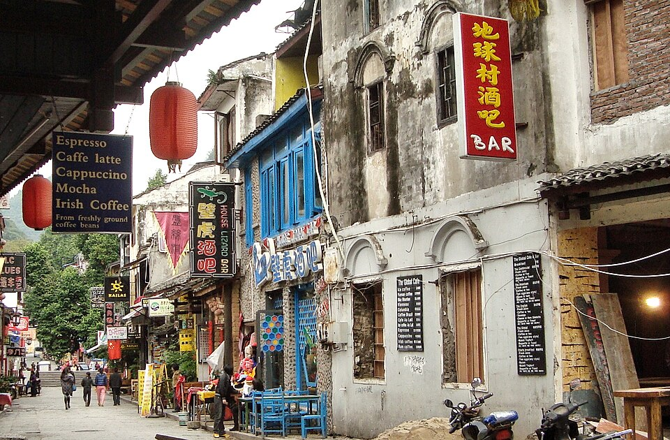
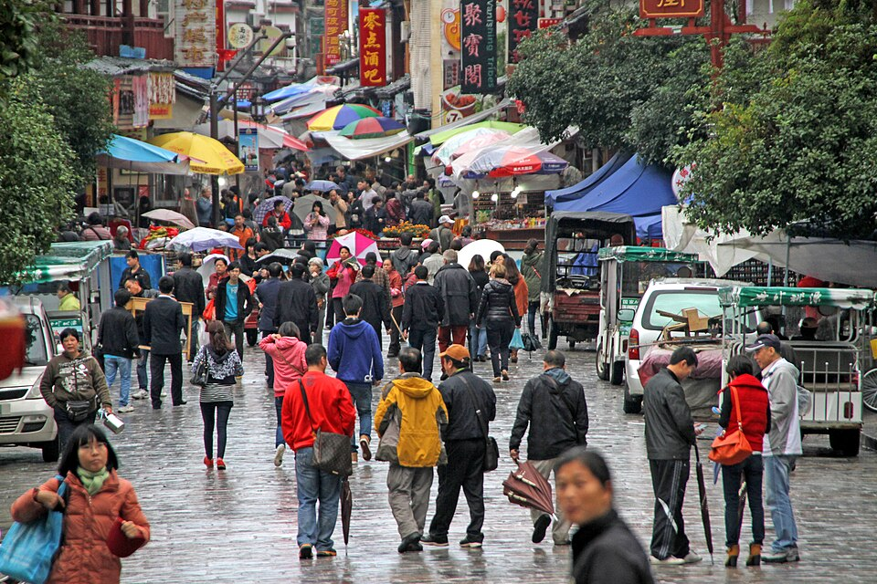
</div>

### 25.10 (вс) — река Юйлун + Луна-гора

**Бамбуковый плот по реке Юйлун (Yulong)**
Тихий приток без круизных теплоходов: неспешный сплав на бамбуковом плоту мимо рисовых полей, древних каменных мостов и холмов. Лучше всего утром, в дымке. Рядом отлично идёт прокат велосипеда по окрестным деревням.

**Луна-гора (Moon Hill)**
Холм со сквозной аркой-«полумесяцем»: по мере обхода арка «превращается» из полной луны в серп. Подъём ~800 ступеней к арке, сверху — панорама долины. Рядом — район скалолазания.

<div class="gallery">
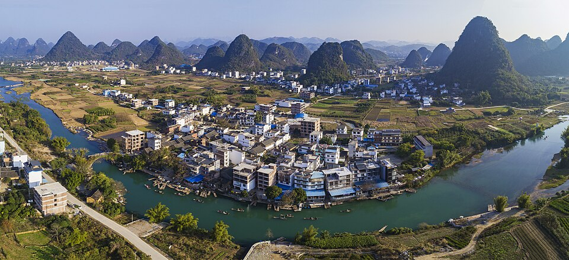
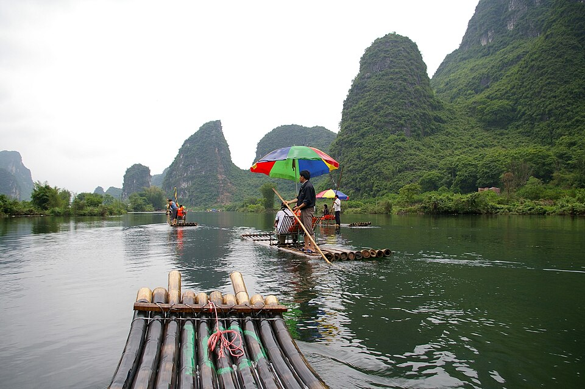
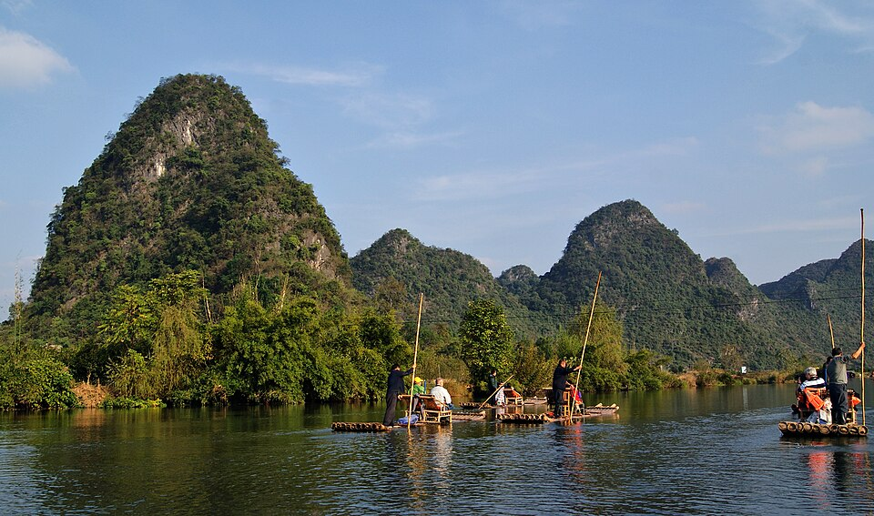

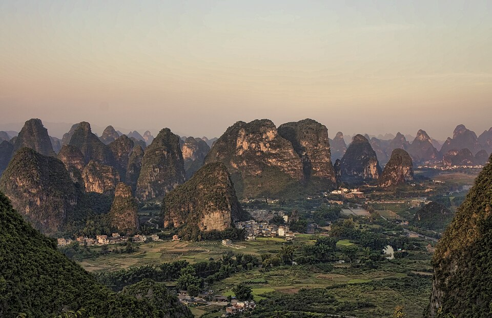
</div>

### 26.10 (пн) — Синпин, Сянгун + вечернее шоу

**Синпин (Xingping) и «вид с ¥20»**
Вместо полного круиза из Гуйлиня (теплоходы идут только по течению) — из Яншо в древний городок **Синпин** (~40 мин), оттуда кораблик или плот по самому красивому участку реки Ли **Яндти → Синпин**: рыбаки на плотах, буйволы у воды и тот самый пейзаж с 20-юаневой банкноты. Дешевле и короче большого круиза, а виды — те же.

**Холм Сянгун (Xianggong Hill)**
Лучшая обзорная точка на излучину реки Ли — короткий, но крутой подъём ~20 минут, сверху «те самые» фото Гуйлиня. По дороге из Синпина; красивее всего в косом вечернем свете или на рассвете.

**Шоу «Impression Sanjie Liu» (вечер)**
Грандиозное ночное представление режиссёра **Чжана Имоу** прямо на воде реки Ли: сцена — 2 км реки и 12 подсвеченных холмов, в шоу заняты сотни местных рыбаков. Свет, музыка и природный «задник» — must-see вечера в Яншо.

<div class="gallery">
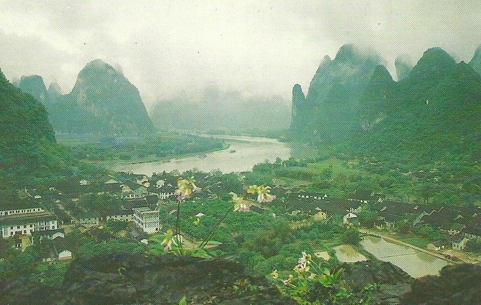
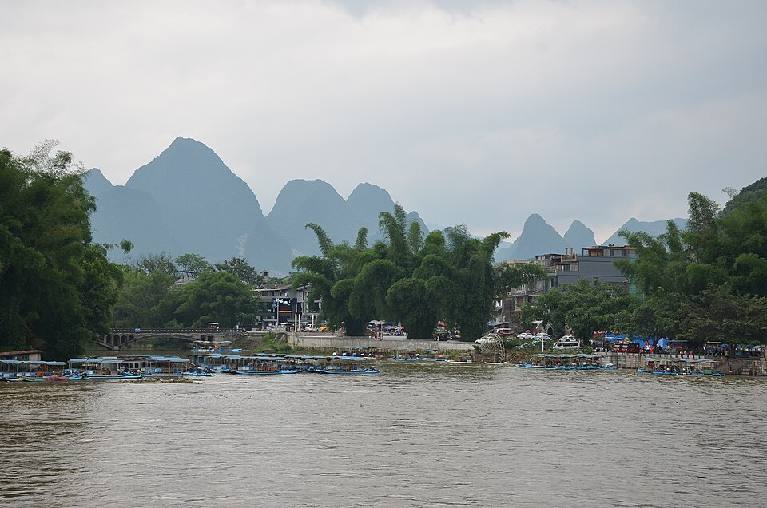
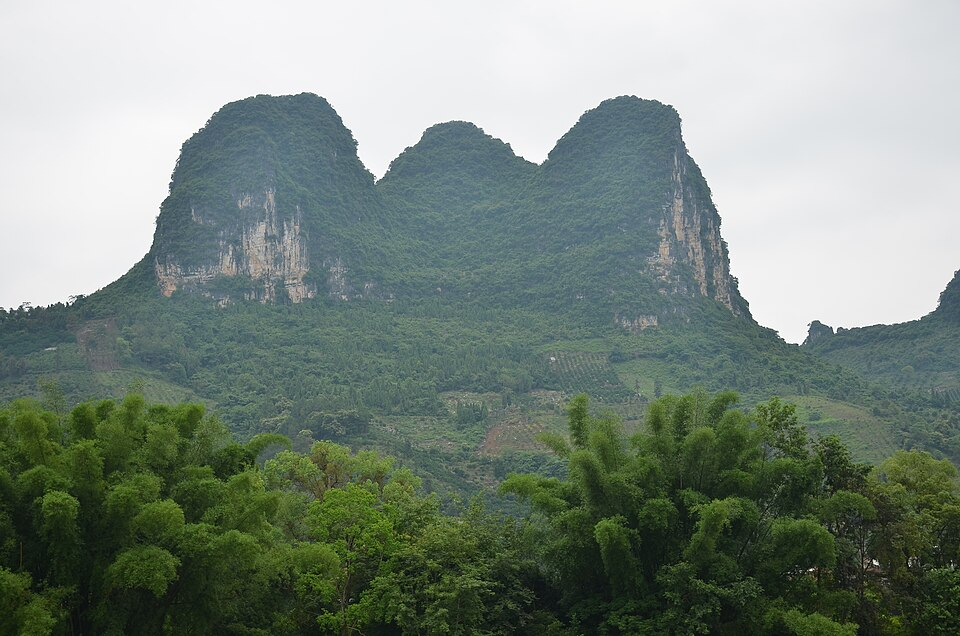


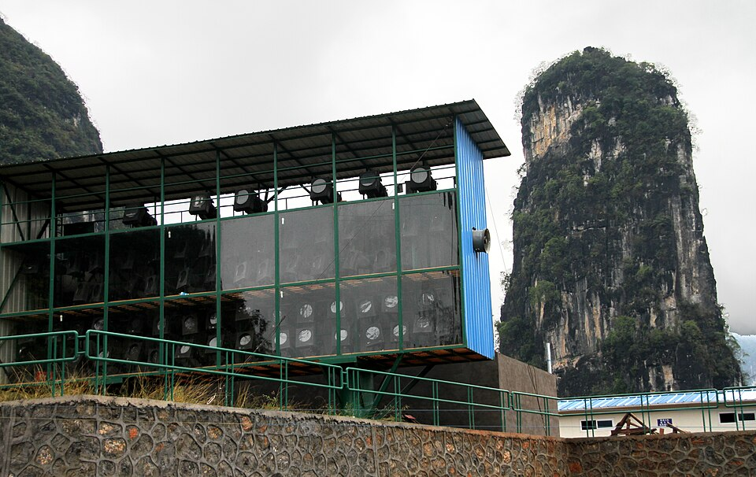
</div>

> 💡 Рисовые террасы **Лунцзи** (полный день от Гуйлиня) в маршрут не помещаются. Если они принципиальны — можно пожертвовать рекой Юйлун 25.10.

---

## 🏮 ФУЖУНЧЖЭНЬ — 27–28 октября (1 ночь)

Древний городок народности **туцзя** (~2000 лет), «висящий на водопаде»: дома на сваях стоят прямо над 60-метровым каскадом Ванцунь. Прославился по фильму «Городок Хибискус» (1986). Главное зрелище — **вечером**, когда водопад и весь ярусный городок подсвечены; днём туристов много, а ночью и ранним утром он ваш.
**Где жить:** гостевой дом с видом на водопад (их много прямо над обрывом).

### 27.10 (вт) → утро 28.10 (ср)

Утром поезд из Яншо с пересадкой в Гуйлине (суммарно ~3–3.5 ч) до станции **Furongzhen**, от станции до городка ~10 км (такси/автобус 15–20 мин).

**Водопад Ванцунь и старый город**
День — на неспешную прогулку, вечером — ночная подсветка водопада и улочек: «золотой» городок над чёрной водой. Утром 28-го — мощёная главная улица без толп (попробуйте фирменный **рисовый тофу мидоуфу**), тропа проходит прямо **за стеной водопада**, внизу — пристань и виды на реку Юшуй. К обеду — на станцию и короткий поезд в Чжанцзяцзе.
<div class="gallery">

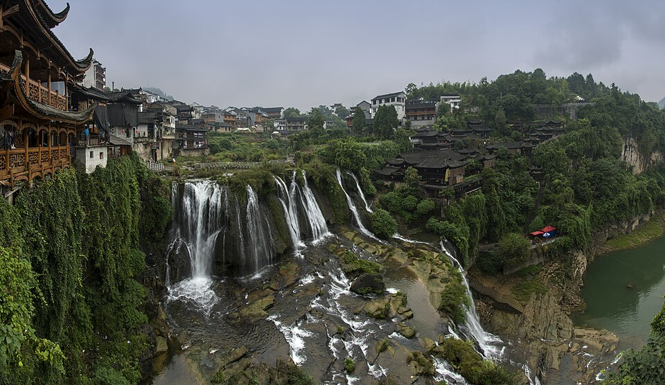

</div>

---

## 🏔 ЧЖАНЦЗЯЦЗЕ — 28–30 октября

«Те самые горы Аватара»: тысячи песчаниковых столбов в тумане, плюс гора Тяньмэнь с «Небесными вратами».
**Тактика:** ночь 29-го — **внутри парка** (Юаньцзяцзе), чтобы к 7 утра быть у смотровых — без очередей и с туманом. Вход ~¥225, действует несколько дней.

### 28.10 (ср) — переезд + Тяньмэнь

Днём поезд **Furongzhen → Чжанцзяцзе-Запад (~35 мин)**, заселение — и сразу на Тяньмэнь (нижняя станция канатки в центре города).

**Гора Тяньмэнь (Tianmen)**
Самая длинная пассажирская канатка мира (~7.5 км) ведёт на вершину; вдоль обрыва — **стеклянные тропы**, а серпантин «98 поворотов» уходит к пещере-арке **«Небесные врата»** (131 м в скале), к которой поднимаются 999 ступеней. Захватывает дух даже у бывалых.
<div class="gallery">


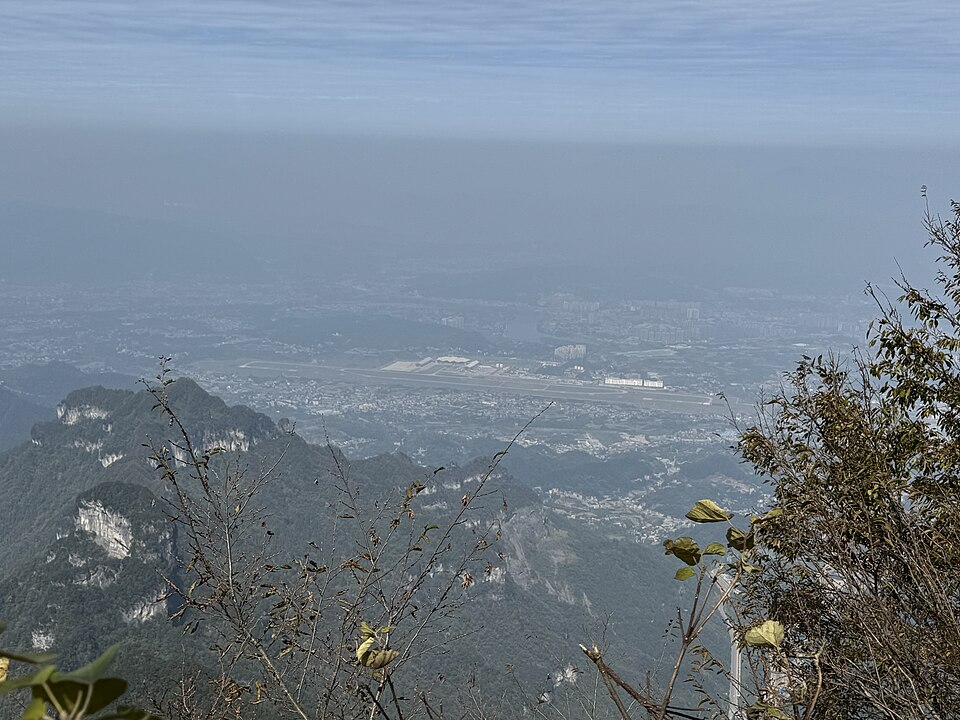

</div>

### 29.10 (чт) — нацпарк, горы «Аватара»

**Юаньцзяцзе (Yuanjiajie)** + лифт Байлун
Плато с легендарной «парящей горой Аллилуйя» — прообразом летающих гор «Аватара» — и мостом «Первый под небом». Наверх поднимает **стеклянный лифт Байлун** — 326 м вдоль отвесной скалы (самый высокий открытый лифт мира). Море каменных пиков в облаках.
<div class="gallery">
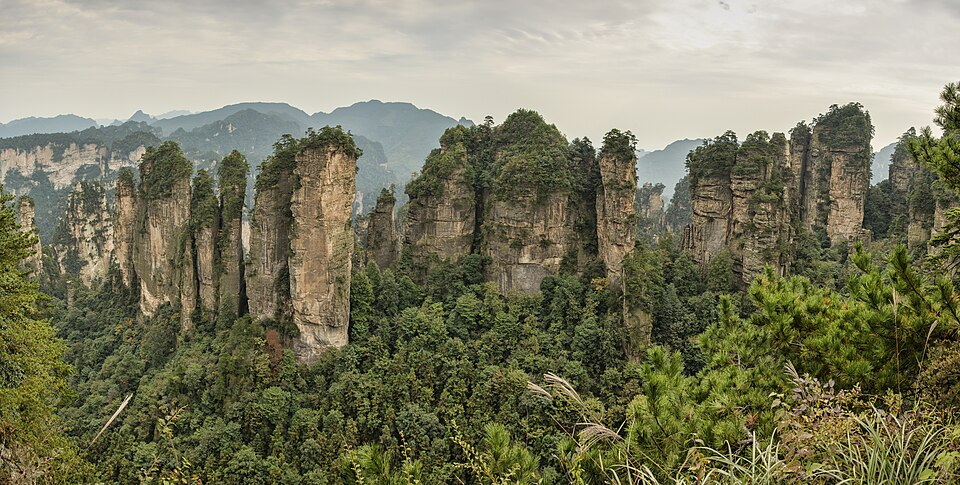

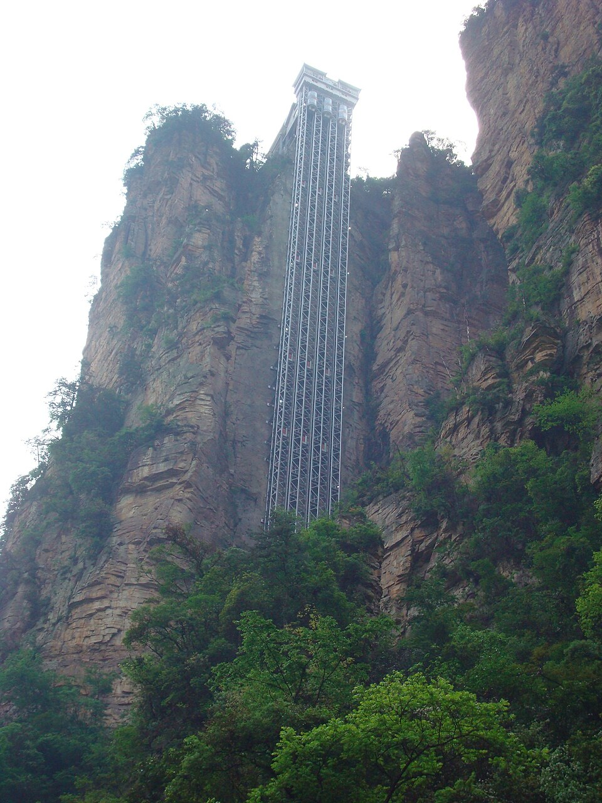
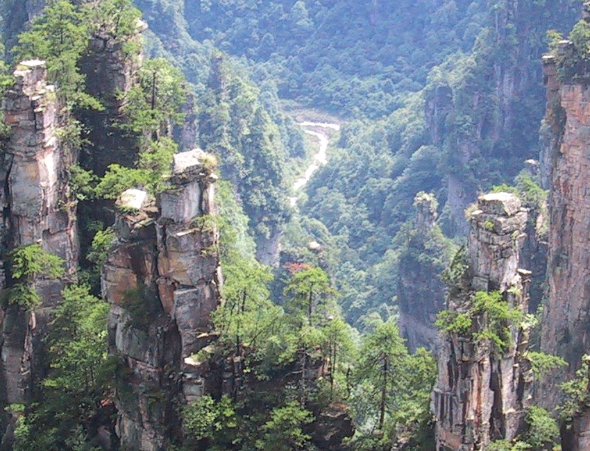
</div>
Ночь в **хоумстее внутри парка** — утром будете у смотровых первыми.

### 30.10 (пт) — Тяньцзы, вечером → Чунцин

**Гора Тяньцзы (Tianzi) + Золотой кнут**
Ранний подъём на **Тяньцзы** — лучшие панорамы «леса пиков» (смотровые Хэлун, «Письмо с небес»). Спуск к **ручью Золотого кнута (Golden Whip Stream)** — лёгкая прогулка по дну ущелья вдоль реки, скал и любопытных макак.

**По желанию: Большой каньон + Стеклянный мост**
Самый длинный и высокий стеклянный мост в мире (430 м длиной, 300 м над дном каньона). Отдельный билет; поместится, только если сократить Тяньцзы — до вечернего поезда нужно вернуться к вокзалу.

<div class="gallery">


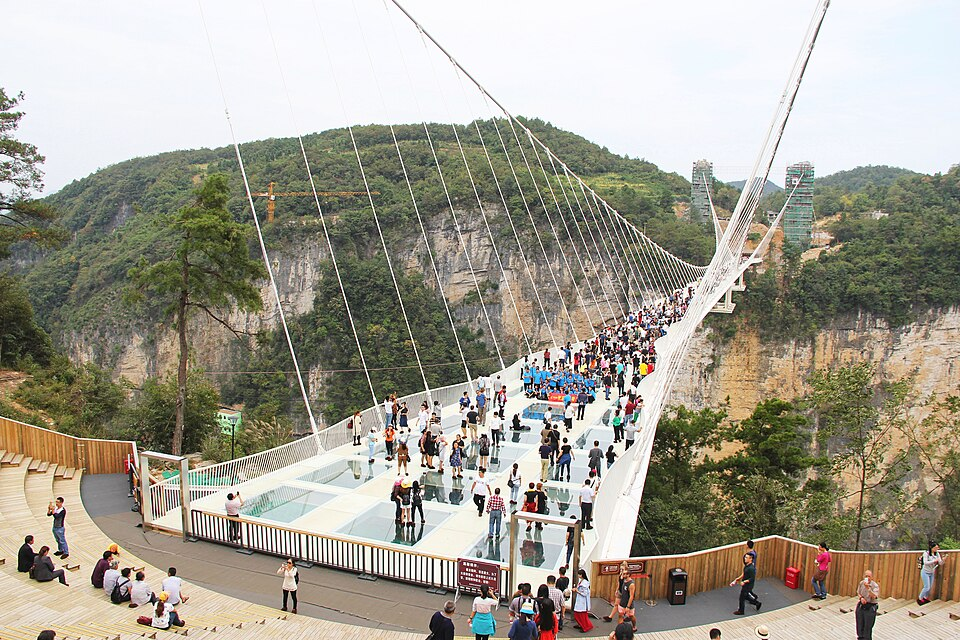

</div>

Вечером — поезд **Чжанцзяцзе → Чунцин (~2–2.5 ч)**, заселение в Цзефанбэе.

---

## 🌃 ЧУНЦИН — 30 октября – 3 ноября

Город-киберпанк: небоскрёбы лезут на скалы над слиянием Янцзы и Цзялин, монорельс ныряет сквозь дом, ночью всё в неоне. Эффектный финал поездки — плюс весь шоппинг напоследок.
**Где жить:** **Цзефанбэй (Jiefangbei)** или у **Хунъядун** — всё пешком, виды на реку.

### 31.10 (сб) — старый Чунцин + неоновый вечер

**Древний городок Цыцикоу (Ciqikou)**
Сохранившийся квартал времён династии Мин/Цин на берегу: узкие мощёные улочки, чайные дома, лавки ремесленников и уличная еда (попробуйте чунцинский острый хого-снек и засахаренные фрукты). Контраст с футуризмом центра — спокойная прогулка на полдня.

**Хунъядун (Hongyadong)** — вечером
Многоярусный «висячий» комплекс в стиле дяолоу, ночью подсвечен золотым — будто кадр из «Унесённых призраками». 11 этажей лавок, еды и смотровых террас, выходящих на реку Цзялин. Приходите в сумерках — лучшее первое «вау» Чунцина.

<div class="gallery">
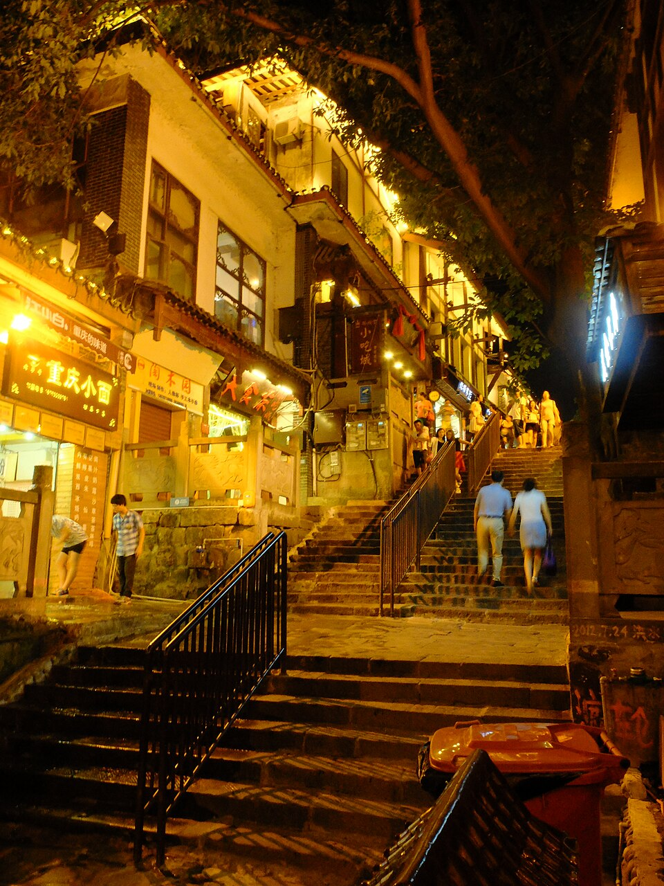

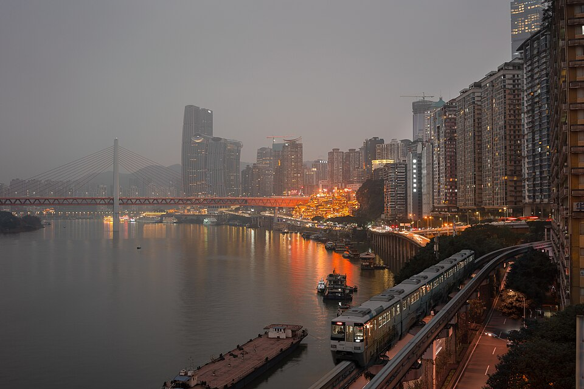
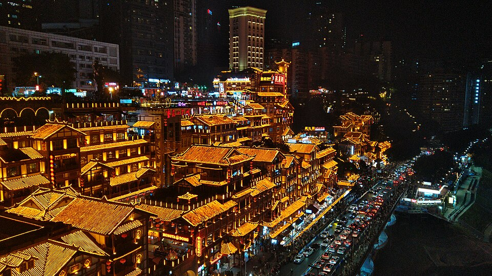
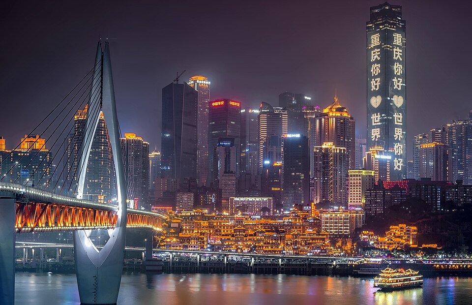
</div>

### 01.11 (вс) — футуризм Чунцина

**Станция Лицзыба (Liziba)**
Монорельс линии 2 проходит прямо сквозь 19-этажный жилой дом — станция встроена в здание. Знаменитый «поезд сквозь дом»; лучший кадр — со специальной смотровой площадки напротив. Поезда идут каждые пару минут.

**Raffles City / Чаотяньмэнь (Chaotianmen)**
Восемь башен на самой стрелке слияния рек, связанные «горизонтальным небоскрёбом»-мостом на высоте 250 м. Смотровая **The Crystal** — панорама стрелки и обеих рек. Сам комплекс похож на парус гигантского корабля.

**Канатка через Янцзы (Yangtze River Cableway)** — на закате
5 минут полёта над водой с видом на оба берега и небоскрёбы. Особенно красиво на закате и в неоне. После — ужин с настоящим чунцинским хого.

<div class="gallery">
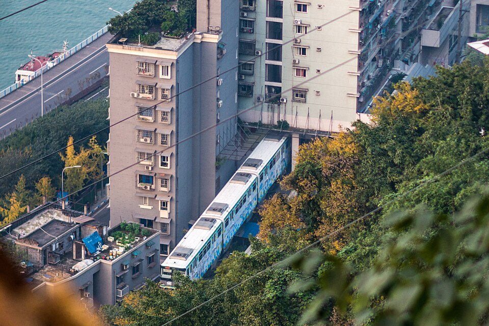
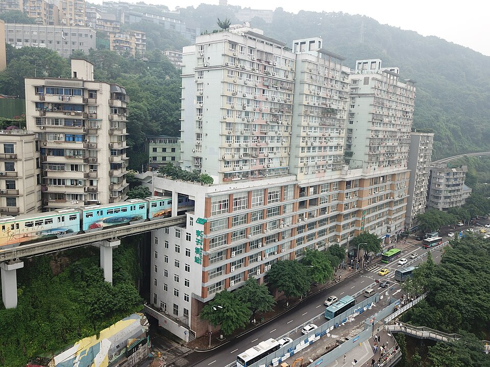
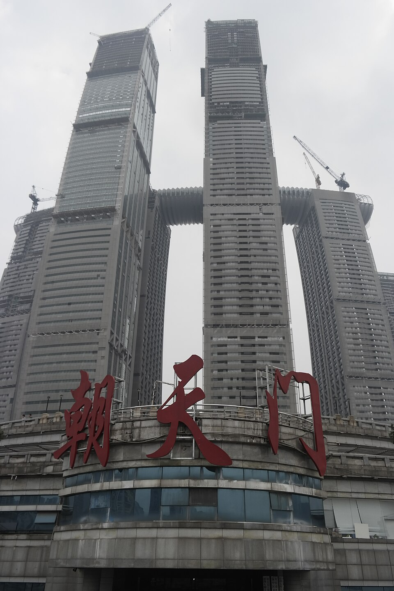
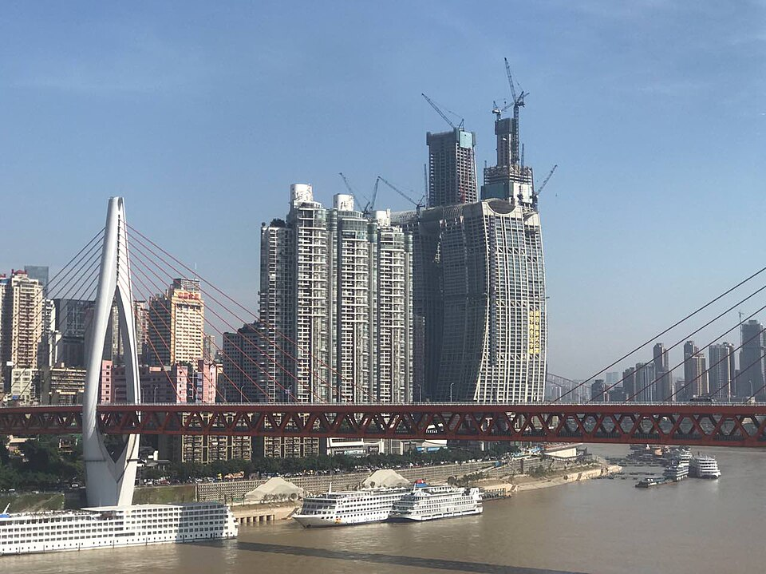

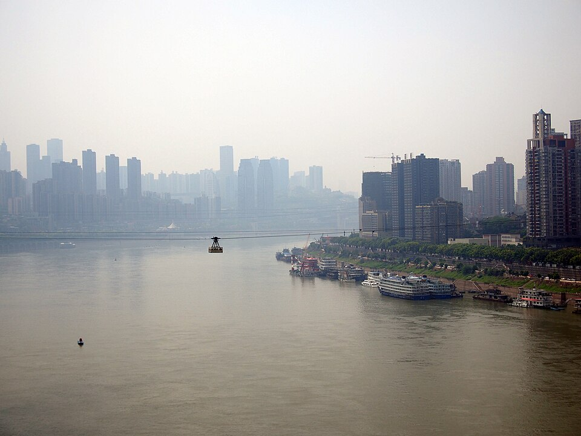
</div>

### 02.11 (пн) — 🛍 шоппинг

Целый день на покупки напоследок:
- **Цзефанбэй (Jiefangbei)** — пешеходный квартал-«Таймс-сквер» Чунцина: большие моллы, флагманы брендов, электроника; рядом **Хунъядун** — сувениры.
- **Гуаньинцяо (Guanyinqiao)** — второй огромный торговый район, местные марки и цены пониже.
- Съедобные подарки: сычуаньский перец, наборы для хого, чай — в супермаркетах и лавках Цыцикоу.

Вечером — закат в **парке Элин (Eling Park)** и прощальный ужин-хого.

### 03.11 (вт) — вылет

Рейс в **11:40** — утреннего буфера нет: выезд из отеля **~08:30**, до аэропорта **Цзянбэй (CKG)** ~45 мин (такси / метро 3-я или 10-я линия). Все покупки — накануне.

---

## ✈️ Возвращение — 3 ноября
- **11:40 — CZ5754** Чунцин → Ухань (1 ч 30 м), стыковка **3 ч 55 м** (багаж сквозной, перерегистрация не нужна).
- **17:05 — CZ8003** Ухань → Шереметьево, 9 ч 10 м. **21:15 — дома в тот же вечер.** ✅

---

## 💰 Бюджет на двоих (комфорт, без еды)

| Статья | Ориентир |
|--------|----------|
| Перелёт Москва↔Китай (open-jaw, 2) | ~110–170 т₽ |
| Поезда (Гуанчжоу→Яншо→Фужунчжэнь→Чжанцзяцзе→Чунцин, 2) | ~16–27 т₽ |
| Отели/апартаменты, 10 ночей | ~40–70 т₽ |
| Входные билеты (Чжанцзяцзе, Тяньмэнь, Фужунчжэнь, Синпин, шоу) | ~22–32 т₽ |
| **Итого (без еды и городского транспорта)** | **~190–300 т₽** |

💡 **Экономия:** open-jaw одним билетом; 2-й класс в поездах (комфортный); билеты в парки и на кораблики — заранее через Trip.com/WeChat; апартаменты вместо отелей.

---

## 📋 Мои бронирования

> Статус: 🔍 ищу · ⭐ кандидат · ✅ забронировано. Цены — за двоих.

### ✈️🚄 Транспорт
| # | Направление | Дата | Рейс/поезд | Цена (2) | Статус | Ссылка |
|:-:|------------|:----:|-----------|:-------:|:------:|--------|
| 1 | ✈️ Москва → Гуанчжоу (CAN) | 23–24.10 | CZ656, 21:15 → 11:40 (+1) | | ⭐ | `[открыть](url)` |
| 2 | 🚄 Гуанчжоу-Южный → Яншо | 24.10 (~16:30) | | | 🔍 | `[открыть](url)` |
| 3 | 🚄 Яншо → Фужунчжэнь (перес. Гуйлинь) | 27.10 (утро) | | | 🔍 | `[открыть](url)` |
| 4 | 🚄 Фужунчжэнь → Чжанцзяцзе-Запад | 28.10 (день) | | | 🔍 | `[открыть](url)` |
| 5 | 🚄 Чжанцзяцзе → Чунцин | 30.10 (вечер) | | | 🔍 | `[открыть](url)` |
| 6 | ✈️ Чунцин (CKG) → Москва | 03.11 | CZ5754 + CZ8003 (Ухань), 11:40 → 21:15 | | ⭐ | `[открыть](url)` |

### 🏨 Жильё
| # | Город | Заезд → выезд | Ночей | Отель | Цена | Статус | Ссылка |
|:-:|-------|:-------------:|:-----:|-------|:----:|:------:|--------|
| 1 | 🏞 Яншо (у Западной улицы) | 24.10 → 27.10 | 3 | | | 🔍 | `[открыть](url)` |
| 2 | 🏮 Фужунчжэнь (вид на водопад) | 27.10 → 28.10 | 1 | | | 🔍 | `[открыть](url)` |
| 3 | 🏔 Чжанцзяцзе (город) | 28.10 → 29.10 | 1 | | | 🔍 | `[открыть](url)` |
| 4 | 🏔 Чжанцзяцзе (внутри парка) | 29.10 → 30.10 | 1 | | | 🔍 | `[открыть](url)` |
| 5 | 🌃 Чунцин (Цзефанбэй) | 30.10 → 03.11 | 4 | | | 🔍 | `[открыть](url)` |

> _Фото — Wikimedia Commons (папка `images/`), для визуализации локаций._
